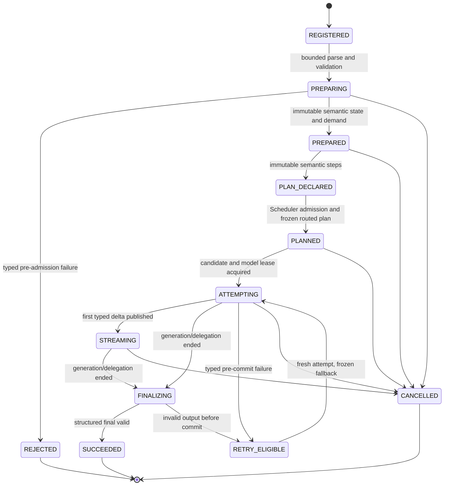
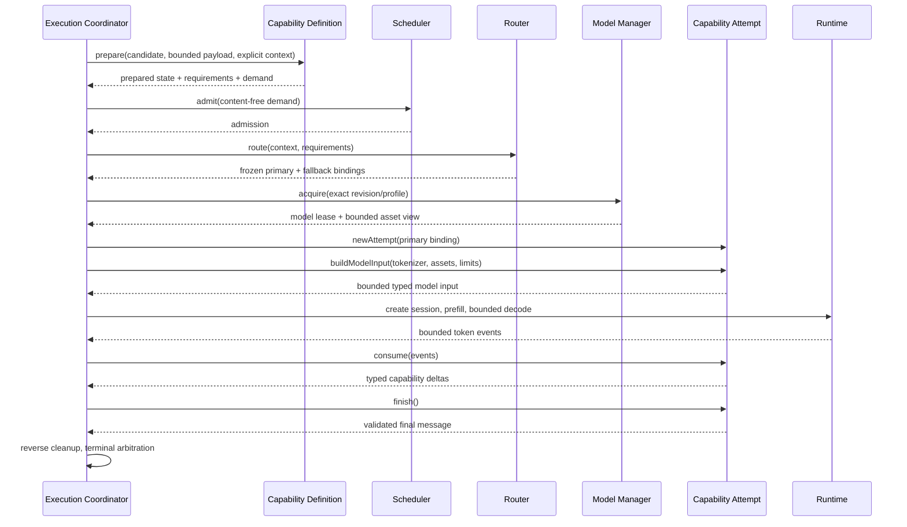
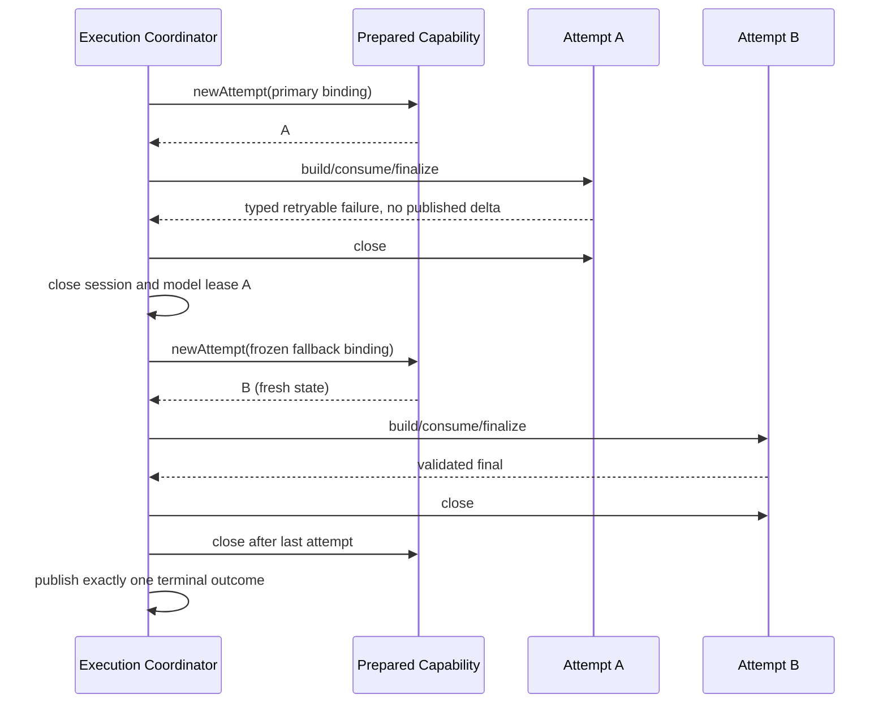

# Capability Framework Architecture Specification v1.0

**Status:** Approved implementation contract

**Date:** 2026-07-13

**Baseline:** Platform Foundation v0.5 (`foundation-v0.5`), Execution Architecture v1.0,
Runtime v1.0, and Model Manager Architecture v1.0

**Scope:** Capability framework and Capability SPI only. This document contains no
production capability, prompt content, SDK facade, keyboard integration, or network design.

This specification defines the boundary every future Touvay capability must implement.
It refines `docs/ARCHITECTURE.md` sections 3.6, 9, 11, 15, and 18 and the capability
interaction contract in `docs/execution/execution-architecture.md`. ADR-004, ADR-009,
ADR-014, ADR-017, ADR-018, ADR-019, ADR-020, and ADR-021 remain normative. On conflict,
an accepted ADR wins until the conflict is reviewed explicitly.

RFC 2119 terms (`MUST`, `SHOULD`, `MAY`) are normative.

## 1. Purpose and goals

The Capability Framework is the semantic layer between versioned request payloads and
the platform execution engine. It allows clients to request an intent such as rewrite,
grammar correction, translation, or summarization without selecting a prompt, model,
runtime, tokenizer, or execution policy.

The framework must:

- expose typed, structured, individually versioned capability contracts;
- keep engine-core independent of capability wire schemas and concrete implementations;
- keep capability implementations independent of Binder, Scheduler internals, Model
  Manager ownership, concrete runtimes, and client applications;
- make prompt construction deterministic, bounded, versioned, and testable;
- distinguish trusted instructions from untrusted user/context data structurally;
- support structured unary and streaming results without exposing raw runtime tokens;
- preserve the frozen-plan, fresh-attempt retry semantics from ADR-017;
- allow model and runtime replacement without changing client contracts;
- provide a conformance suite that future capabilities must pass; and
- admit future image, audio, and document inputs without creating a second execution
  architecture.

## 2. Non-goals

This version does not define:

- any rewrite, grammar, translation, summarization, generation, vision, or speech logic;
- actual system prompts, few-shot examples, templates, or decoding values;
- public SDK facade signatures or new AIDL methods;
- keyboard behavior, ambient context collection, clipboard access, or IME integration;
- model download, installation, catalog storage, or runtime registration;
- a generic client-supplied prompt tunnel;
- runtime-loaded third-party capability code;
- durable conversations, transcripts, prompts, or Runtime sessions; or
- capability quality thresholds for a particular model pack.

## 3. Architectural position and dependency direction

The framework follows ports and adapters:

```text
touvay-contract schemas
          ^
          | parsed/serialized only inside capability modules
          |
capability-* implementations ---> engine-core Capability SPI
          |                              ^
          |                              |
          +------------------------------+--- execution ports

engine-service composition root registers concrete capabilities
engine-core never depends on a concrete capability module
```

The production Capability SPI is owned by `engine-core`. Future `capability-*` modules
implement it and may depend on:

- `engine-core` for the Capability SPI and execution-facing value types;
- `touvay-contract` for their approved protobuf wire schemas; and
- `runtime-api` only for narrow immutable facts explicitly exposed by the SPI.

Capability modules MUST NOT depend on `engine-service`, a concrete runtime adapter,
Android UI code, Scheduler implementations, or Model Manager concrete types. They MUST
NOT open files by model-store path. Signed prompt/config assets are exposed through a
bounded execution-owned asset port.

The composition root is the only place concrete capability definitions are registered.
Registration is compile-time code composition under ADR-006; model packs remain data.

## 4. Vocabulary and identities

| Term | Meaning |
|---|---|
| Capability ID | Stable lowercase namespaced intent, for example `text.rewrite`. |
| Wire schema version | Positive integer selecting the request/delta/final protobuf contract. |
| Capability key | Exact `(capabilityId, wireSchemaVersion)` pair. |
| Implementation revision | Engine-internal revision of capability code and behavior. |
| Prompt recipe | Typed, code-owned semantic instructions and named data slots; never raw client text. |
| Prompt recipe revision | Monotonic revision of one recipe with a reproducible source digest. |
| Prompt format asset | Signed model-pack data that renders typed roles/slots for a model family. |
| Plan binding | Frozen model, execution profile, prompt/config assets, output mode, and limits for one candidate. |
| Capability execution plan | Immutable ordered semantic steps declared by a prepared capability before routing. |
| Routed execution plan | ADR-017 request plan that freezes candidates and assets for every semantic step. |
| Execution step | Stable, ordered unit of capability work; v1 implements prompt steps only. |
| Prepared capability | Validated request-scoped semantic state, independent of any model instance. |
| Capability attempt | Fresh mutable formatter/parser/assembler state for exactly one plan candidate. |
| Delta | Typed capability-schema event; not a runtime token and not necessarily text. |

Model pack version, Runtime adapter version, SDK version, capability schema version,
implementation revision, and prompt revision are independent identities. They MUST NOT
be collapsed into one version number.

## 5. Capability contract

### 5.1 Descriptor

Every capability exposes one immutable descriptor containing at least:

- exact capability key;
- implementation revision;
- supported input and output modalities;
- unary/streaming support;
- whether an explicit client coalescing key is permitted;
- hard inline and bulk-input limits;
- hard output and delta limits;
- prompt strategy (`NONE`, `TYPED_RECIPE`, or `DELEGATED`);
- supported structured-output strategies;
- required capability-framework feature identifiers; and
- local conformance profile identifier.

The descriptor contains no installed model IDs, runtime IDs, prompt text, user content,
paths, or mutable availability state. Availability is the join of the descriptor,
catalog, device policy, trust policy, and Runtime Registry at query time.

### 5.2 Registry identity

Production registration MUST be keyed by `CapabilityKey`, not capability ID alone. This
is required by ADR-009 so `text.rewrite@1` and `text.rewrite@2` can coexist during a
compatibility window.

Exactly one compiled definition may own a given key. Duplicate registration is a
composition error. The registry is immutable after process composition and is safe for
concurrent reads.

`CapabilityFrameworkRegistry` is the production definition/discovery registry and uses
the exact key. The execution-facing `ExecutionProgramRegistry` also resolves exact keys,
so side-by-side schema versions remain distinct through Coordinator submission. The
older `CapabilityRegistry` remains only for the `dev.echo` diagnostic walking skeleton;
it is not a second production source of truth.

### 5.3 Wire contract

All public request, delta, and final schemas are owned by `touvay-contract` under
ADR-014. Capability modules parse and produce those schemas but do not own them.

Wire rules:

- parsing is bounded before materializing repeated/string/byte fields;
- unknown optional fields are tolerated according to protobuf compatibility rules;
- unknown required semantic features fail with a typed unsupported-version result;
- required fields and enum values are validated explicitly rather than relying only on
  protobuf defaults;
- retained byte arrays and collections are defensively copied or wrapped immutably;
- a schema version never changes the meaning of an existing field incompatibly; and
- a semantic change that cannot be represented additively requires a new wire schema
  version and a side-by-side registry entry.

## 6. Capability lifecycle



Lifecycle ownership:

1. The registered definition is immutable and process-lived.
2. `prepare` creates request-scoped parsed state without model, Runtime, file, or session
   acquisition.
3. Prepared state declares an immutable ordered capability execution plan.
4. The Router freezes one or two exact candidate bindings for each supported step.
5. Each candidate creates a new attempt with independent mutable assembly state.
6. The Coordinator owns tokenization, Runtime/session calls, credits, cancellation,
   retry, and cleanup.
7. The attempt transforms bounded model/delegate output into typed deltas/final output.
8. Attempt state closes before model/session ownership is released; prepared state
   closes after the last attempt; terminal publication follows reverse cleanup.

Prepared or attempt objects MUST be single-request and MUST NOT be cached in the
definition. An internal retry reuses the immutable prepared state but creates a fresh
attempt.

## 7. ExecutionPlan abstraction

The Capability Framework introduces an immutable `CapabilityExecutionPlan` between a
prepared capability and any `PromptRecipe`. It is the semantic, unbound form of the
request plan. ADR-017's existing routed `ExecutionPlan` is the frozen execution form.
They are two phases of one plan lifecycle, not competing sources of routing truth:

```text
CapabilityDefinition
  -> PreparedCapability
  -> CapabilityExecutionPlan (ordered semantic steps, no model/runtime identity)
  -> Router
  -> ExecutionPlan (same steps with exact candidates/assets/limits)
  -> ExecutionAttempt per selected step candidate
```

A capability execution plan contains one to eight ordered steps. Each step has:

- a stable step ID unique within the plan;
- a step kind;
- references only to prepared input, explicit context, or outputs of earlier steps;
- step-local routing requirements and conservative demand;
- a declared output binding consumed by later steps or final assembly; and
- no installed model, Runtime, path, lease, session, callback, or mutable state.

V1 defines `PromptExecutionStep`, whose payload is a typed `PromptRecipe`. The initial
runtime adapter MUST accept exactly one prompt step and reject multi-step execution with
a typed unsupported-framework-feature failure. The plan model, registry, TCK, asset
binding, and validation support multiple ordered prompt steps now so later orchestration
can execute them without changing the Capability SPI.

Step dependencies are a forward-only sequence: a step may read outputs from lower-index
steps but never itself or a later step. Cycles, duplicate IDs, missing bindings, unused
required outputs, or more than eight steps reject preparation. Intermediate values are
request-scoped, bounded, memory-only, and never become public deltas unless the public
capability schema explicitly maps them.

Routing freezes candidates and exact prompt/config assets per step. A retry chooses the
precomputed fallback for the current step without rebuilding the capability plan. The
first public delta remains the request-wide commit point. Process death restarts the
whole client request from supplied input; no step checkpoint is durable.

## 8. Capability SPI

The following Kotlin is conceptual and defines semantics, not approved source API names.
The implementation may refine names while preserving ownership and direction.

```kotlin
interface CapabilityDefinition {
    val descriptor: CapabilityDescriptor

    suspend fun prepare(
        context: CapabilityPreparationContext,
        wireRequest: BoundedWirePayload,
        injectedContext: CapabilityContext,
    ): PreparedCapability
}

interface PreparedCapability : AutoCloseable {
    val executionPlan: CapabilityExecutionPlan
    val executionDemand: ExecutionDemand

    fun newAttempt(
        step: PromptExecutionStep,
        binding: CapabilityPlanBinding,
    ): CapabilityAttempt
}

interface CapabilityAttempt : AutoCloseable {
    suspend fun buildModelInput(environment: AttemptEnvironment): ModelInput
    fun decodingPolicy(environment: AttemptEnvironment): CapabilityDecodingPolicy
    suspend fun consume(events: List<ModelOutputEvent>): List<CapabilityDelta>
    suspend fun finish(): CapabilityFinal
}
```

The SPI uses opaque wrappers rather than unowned `ByteArray` fields for wire payloads,
assets, and bulk handles. A ByteArray-carrying type MUST NOT be a Kotlin `data class`.

### 8.1 Definition responsibilities

A definition:

- declares immutable contract metadata;
- performs bounded schema parsing and semantic validation;
- converts the wire request and approved context into immutable prepared state;
- derives conservative routing requirements and execution demand; and
- creates fresh attempt-local behavior from a frozen plan binding.

It does not select models, inspect the catalog, call a runtime, retry, or emit callbacks.

### 8.2 Prepared-capability responsibilities

Prepared state may retain only data required for the request. It owns parsed user input
until terminal cleanup and therefore is privacy-sensitive. It MUST NOT expose raw input
through `toString`, equality diagnostics, logs, or exception messages.

Preparation returns conservative facts before admission. Model-dependent token counts
are finalized only after the candidate tokenizer is available; the pre-admission demand
must overestimate safely or carry a bounded range.

### 8.3 Attempt responsibilities

An attempt is candidate-local and mutable. It may own:

- a typed prompt recipe instance;
- deterministic truncation decisions;
- structured-output parser state;
- delta coalescing/assembly state; and
- bounded final-result construction.

It never owns the model lease, Runtime session, CancelSignal, Scheduler permit, credit
window, Binder callback, or retry loop.

## 9. Structured inputs

Capability requests MUST be domain contracts, not prompt strings. Examples of contract
shapes include text plus rewrite options, source/target locale plus segments, or a
document plus requested summary structure. This document does not define those schemas.

Input preparation follows this order:

1. enforce envelope and declared byte limits;
2. bounded-parse the exact schema version;
3. validate field presence, enum values, lengths, counts, Unicode policy, and mutually
   exclusive options;
4. normalize only where the capability contract explicitly permits it;
5. validate explicitly supplied context and provenance;
6. derive immutable semantic input and routing needs; and
7. discard parser-owned transient buffers.

Normalization MUST NOT silently change offsets used by a structured result. A capability
that returns spans defines whether offsets use UTF-16 code units, Unicode scalar values,
grapheme clusters, tokens, or source segment IDs in its public schema.

Large image, audio, and document inputs use future leased bulk handles. Inline payloads
remain subject to the platform 512 KiB ceiling. A capability receives bounded borrowed
views and never closes transport-owned descriptors directly.

## 10. Context injection

Context injection is explicit, structured, and least-privilege. The engine does not
ambiently read keystrokes, surrounding text, clipboard data, app screens, contacts, or
another request. Every content-bearing context item originates from an explicit client
request or a separately approved future consent boundary.

`CapabilityContext` is immutable and distinguishes:

- content-free engine facts such as requested locale, policy generation, and feature
  negotiation;
- client-supplied content with declared purpose and provenance;
- client-owned logical transcript fragments supplied for this request under ADR-019;
- future bulk modality handles with explicit size/type metadata; and
- trusted capability configuration selected by the frozen plan.

Each content fragment carries a stable local identifier, modality, declared units,
truncation class, and sensitivity class. It does not carry logging permission.

Untrusted content MUST never be interpolated into an instruction/control slot. The
prompt representation preserves structural roles through rendering. Delimiters,
escaping, and model-family formatting are renderer responsibilities; capabilities do
not concatenate raw context into a system instruction.

Context is request-scoped, memory-only, and released at terminal cleanup. Missing
optional context is represented explicitly. Missing required context fails before
admission with a typed content-free error.

## 11. Prompt construction

### 11.1 Typed prompt recipe

Production capabilities MUST NOT return an unconstrained raw prompt string as their
semantic interface. They produce a typed `PromptRecipe` containing ordered elements such
as:

- trusted instruction blocks identified by recipe-local IDs;
- typed untrusted data slots;
- explicit context slots;
- output-schema/format constraints;
- optional examples identified as trusted engine/pack data; and
- modality placeholders.

The recipe contains no model chat syntax. A signed model-pack prompt-format asset maps
typed roles and slots to the target model family. The format language is
substitution-only: no loops, conditionals, reflection, code execution, includes outside
the exact revision, environment access, or arbitrary function calls.

Prompt-format and capability-config assets use bounded, versioned protobuf-lite schemas
owned by the Capability Framework, not the public capability wire contract and not the
model-pack manifest schema. The manifest authenticates their exact bytes, role, size,
and digest but does not interpret them. A format asset declares its schema version,
compatible capability key/recipe range, ordered role blocks, literal fragments, typed
slot references, required formatter features, and hard expansion limits. Duplicate
slots, unknown required features, trailing semantic ambiguity, and incompatible recipe
bindings reject the candidate. Mustache/Jinja-style logic, JSON configuration bags, and
arbitrary chat-template execution are not supported.

Task-specific models and delegated backends may declare prompt strategy `NONE` or
`DELEGATED`. A token-generating LLM candidate that requires a format asset is ineligible
if the exact signed asset is missing, oversized, malformed, or incompatible with the
recipe contract.

### 11.2 Frozen prompt binding

Each execution candidate freezes:

- capability key and implementation revision;
- prompt recipe ID and revision;
- exact model revision;
- exact template/config logical references, declared sizes, and signed file digests;
- structured-output strategy;
- context/output limits and decode quantum; and
- required execution features.

Retries reuse this frozen candidate binding or its precomputed fallback. They never
look up a newer prompt asset, active pack, policy generation, or implementation midway.

`ExecutionCandidate` carries the semantic step ID and exact prompt asset reference,
declared byte size, and SHA-256 digest. `AttemptProgram.buildModelInput` receives a
model-bound environment and returns exact tokenized input. The old `prompt()` hook is a
compatibility default used only by the diagnostic execution fixtures; production
capabilities use the typed path.

### 11.3 Bounded rendering and token budgets

The Coordinator supplies an attempt environment containing:

- candidate tokenizer access;
- immutable model context facts;
- bounded read-only access to exact signed prompt/config assets;
- plan limits and reserved output budget; and
- content-free execution context.

The renderer computes:

```text
max_input_tokens = min(plan_context_limit, runtime_context_limit)
                   - reserved_output_tokens
                   - runtime_required_margin
```

Trusted instructions, output constraints, and mandatory control tokens are never
silently truncated. Capability-owned truncation policy assigns every content fragment
one of:

- `REQUIRED` - fail if it cannot fit;
- `DROP_FIRST` - remove the whole fragment before truncating required content;
- `TRUNCATE_HEAD` or `TRUNCATE_TAIL` - truncate only on capability-defined safe units;
- `SEGMENT_PRIORITY` - drop complete low-priority segments deterministically; or
- `SUMMARIZE_NOT_ALLOWED` - never launch a hidden recursive capability request.

Final rendered input is tokenized exactly and checked against the budget. Approximate
counts may guide a bounded search but never authorize an oversized final prompt.
Truncation decisions are deterministic for the same prepared input, candidate binding,
and tokenizer.

### 11.4 Asset access

Capability code receives a bounded `PromptAssetSource`, not model-store paths.
The reader:

- is scoped to the exact leased revision;
- exposes only assets named by the frozen candidate;
- enforces declared role, digest, and size ceilings;
- returns immutable/owned content or a bounded stream;
- cannot enumerate unrelated pack files; and
- becomes unusable when the attempt lease ends.

The Model Manager remains the owner of files and mmap safety. The capability framework
interprets prompt/config data but cannot install, activate, delete, or retain it.

## 12. Model and runtime selection

### 12.1 Capability-declared routing requirements

A prepared capability declares semantic requirements, not a concrete backend:

- exact capability key;
- input/output modalities;
- structured-output and streaming requirements;
- required typed execution features, such as constrained decoding when mandatory;
- minimum context and maximum requested output units;
- conservative fixed RAM, KV, and load-cost demand;
- trust policy and whether untrusted imported packs are eligible;
- quality floor/profile selected by engine policy; and
- whether delegated execution is semantically supported.

It MUST NOT name an installed pack, Runtime ID, adapter class, device model, or file path.

### 12.2 Router responsibilities

The Router joins the requirements with:

- exact schema-compatible catalog capability descriptors;
- active/eligible model revisions and trust state;
- signed template/config references;
- device and thermal policy;
- Runtime Registry compatibility and required features;
- resource budgets and loaded-instance affinity; and
- quality evaluation metadata approved for that pack.

It returns an immutable plan with one primary and at most one fallback. Ranking is
central policy; capability code cannot reorder candidates after routing.

### 12.3 Runtime selection

Capability code is runtime-agnostic. It can request a typed semantic feature but cannot
probe or resolve an adapter. Runtime Registry and Model Manager resolve the manifest's
runtime requirement and canonical execution profile under ADR-015.

Token-level and delegated plans share input validation, policy, output validation,
streaming semantics, and terminal arbitration. Delegated plans may bypass prompt
rendering, but they do not bypass the capability's structured output validator or
privacy/error rules.

## 13. Structured outputs and streaming model

### 13.1 Final output

Every successful request produces exactly one final message of the capability's exact
wire schema version. The final result is authoritative and must satisfy:

- schema and semantic validation;
- capability-specific size/count limits;
- stable offset/unit rules;
- UTF-8/Unicode validity where applicable;
- no undeclared model/prompt/runtime identity; and
- consistency with all schema-defined committed deltas.

Free-form model text is never returned as a structured result without capability-owned
validation and assembly.

### 13.2 Token consumption

The Runtime token sink remains a Coordinator concern. After each bounded decode quantum,
the attempt receives an ordered immutable batch of model output events. It may hold only
bounded parser state and returns zero or more typed deltas.

Capability parsers MUST handle token pieces that split UTF-8/code point/JSON boundaries.
They MUST NOT assume one token equals one character, word, field, or delta.

### 13.3 Delta semantics

Streaming is capability-defined and schema-versioned. A delta may represent append text,
a completed translation segment, a correction candidate, structured field progress, or
another explicitly documented event. Raw token IDs and model token pieces never cross
the public contract.

For every streaming schema, the capability contract defines:

- delta ordering and idempotence expectations;
- whether deltas are provisional or committed;
- how clients reconstruct the visible intermediate result;
- relation between deltas and the authoritative final message;
- maximum delta size and maximum deltas per request; and
- behavior when final validation fails after provisional output.

The Coordinator assigns transport sequence numbers, consumes count-and-byte credits,
and serializes callbacks under ADR-018. Capability code does not see credit grants and
does not block on Binder. It SHOULD coalesce tiny token-level changes into useful bounded
domain deltas.

The first published delta remains the retry commit point under ADR-017. After that point,
no internal candidate fallback is permitted.

## 14. Error handling

Capability failures are typed and content-free. The framework defines internal
categories at minimum:

| Failure | Phase | Public class | Retry |
|---|---|---|---|
| Malformed wire payload | prepare | invalid request | Never unchanged |
| Unsupported schema/feature | prepare | unsupported capability/schema | Client or engine upgrade |
| Invalid option combination | prepare | invalid request | Change request |
| Input/context too large | prepare/render | input too large | Reduce input |
| Required context absent | prepare | invalid request | Supply context |
| Prompt/config asset invalid | attempt setup | capability/model unavailable | Fallback before commit |
| Model output malformed | finalization | invalid output | Policy fallback before commit |
| Capability invariant failure | any | internal | Never automatically |
| Cancellation/preemption/deadline | orchestration | existing execution mapping | Per ADR-017 |

Exceptions from protobuf, template/config parsing, output parsing, or capability code
are converted at the capability boundary. Public messages come from static engine-owned
tables and never contain payload fields, prompt fragments, model output, file paths,
model IDs, exception messages, or another client's state.

Capability implementations MAY create a content-free local incident code. They MUST NOT
write user content to diagnostics. Incidents remain local-only under ADR-013.

## 15. Retry behavior

Capabilities never start or schedule retries. The Coordinator is the only retry owner.

An internal fallback is permitted only when all ADR-017 conditions hold:

- the frozen plan includes a fallback candidate;
- no client-visible delta has been published;
- the request is not cancelled, expired, or terminal;
- the failure is typed as retryable by the candidate policy; and
- the first attempt has released its attempt state, Runtime session, and model lease.

The fallback receives the same immutable prepared capability and a new
`CapabilityAttempt`. It may bind a different exact model, runtime profile, prompt format,
or structured-output mechanism already frozen in candidate two. It does not reparse the
wire request, reroute, or reuse partial parser/KV state.

Capability output-invalid failures are retryable only when the plan explicitly allows
them and no delta has committed the stream. Validation and invariant failures caused by
the request or capability code are not made retryable merely because a fallback exists.

## 16. Versioning

### 16.1 Capability versioning

The public compatibility identity is `CapabilityKey(id, wireSchemaVersion)`.

A new wire version is required when changing field meaning, required structure, offset
units, delta reconstruction semantics, or final-result guarantees incompatibly. Additive
optional fields with safe defaults stay within the existing version.

Old and new versions may coexist. Discovery advertises each supported key and its
availability. Removing a version requires the platform's reviewed deprecation window;
it is not coupled to a model-pack or prompt update.

### 16.2 Implementation revision

Capability code carries an internal revision used by golden results, quality reports,
and frozen plan diagnostics. It is not a public compatibility promise. A code change that
alters semantic behavior without changing the wire contract increments this revision
and reruns conformance plus quality gates.

### 16.3 Prompt versioning

Every prompt recipe has a stable ID, monotonic revision, and reproducible digest. Any
change to trusted instructions, examples, slot structure, output constraints, or
truncation policy increments the recipe revision.

The exact model-pack template/config file digests are already authenticated by the pack
manifest. A reproducible prompt fingerprint is:

```text
capability key
+ implementation revision
+ prompt recipe id/revision/digest
+ exact template/config asset digests
+ structured-output strategy revision
+ exact model revision
```

This fingerprint is local test/diagnostic metadata. It is never exposed to clients as a
model identity and never contains prompt or user content.

Prompt-only updates arrive either with engine code (recipe change) or a newly signed
model-pack revision (format/config asset change). Existing installed revisions remain
immutable, so rollback restores the prior exact fingerprint.

## 17. Security and privacy invariants

- Capability modules contain no network dependencies and never perform network I/O.
- User input/context/output is memory-only and request-scoped.
- No capability logs or persists payloads, prompt renderings, token pieces, or results.
- Signed templates/configs remain untrusted parser input despite signature validity.
- Template/config parsers are bounded and fuzz-tested; no executable template language
  is permitted.
- User/context data occupies data roles only and cannot become trusted instructions.
- Client-supplied model IDs, runtime IDs, template paths, or prompt revisions are ignored
  unless a future public contract explicitly authorizes a safe policy input.
- Capability code receives no Binder identity beyond content-free policy projections.
- One client cannot observe another client's context, cache, availability detail, or
  coalescing identity.
- Generic generation, if ever authorized, still uses an engine-owned system policy and
  structured request fields; it is not an unrestricted system-prompt override.

## 18. Threading, cancellation, and ownership

Preparation, rendering, parsing, and finalization run off Binder and Android main
threads on bounded engine dispatchers. Capability code must be coroutine-cancellable;
CPU-bound parsing/assembly loops check cancellation at bounded units of work.

Capability hooks are serialized for one request attempt. They may be invoked on
different worker threads with happens-before ordering and must not use thread-local
request state.

Ownership table:

| Resource | Owner | Release |
|---|---|---|
| Capability definition | Composition root/registry | Engine shutdown |
| Wire payload snapshot | Request record, then prepare call | Preparation/terminal cleanup |
| Prepared capability | Request | After final attempt |
| Injected content context | Request/prepared capability | Terminal cleanup |
| Prompt recipe instance | Attempt | Attempt close |
| Signed asset view | Model lease/attempt environment | Before model lease close |
| Structured parser/assembler | Attempt | Attempt close |
| Runtime session/model lease | Coordinator | ADR-017 reverse cleanup |
| Delta credits/callback | Coordinator/transport | Terminal/client death |

`close()` operations are idempotent and content-free. Capability cleanup must not throw
through the terminal path.

## 19. Future multimodal support

The Capability SPI is modality-neutral. Future modalities extend structured values and
ports rather than adding parallel lifecycle or retry systems.

Multimodal rules:

- inline metadata remains protobuf; large bytes use leased bulk handles;
- every handle has declared media type, byte size, dimensions/duration/page limits, and
  read-only ownership;
- preparation validates metadata before mapping/decoding;
- capability code receives a bounded modality decoder/reader port, not an arbitrary
  file descriptor or path;
- prompt recipes use typed image/audio/document slots;
- Router requirements declare modality encoder/runtime features;
- an attempt cannot retain an embedding or mapped input beyond its lease;
- cancellation closes mappings/decoders in reverse order; and
- public deltas remain capability-schema events rather than runtime embeddings/tensors.

The first concrete modality requires its own threat model, bulk-handle lifetime tests,
and typed Runtime optional feature/TCK. No speculative Runtime SPI is added by this
document.

## 20. Testing strategy

### 20.1 Unit and golden tests

Every capability implementation must include:

- bounded parser positive, negative, boundary, and unknown-field tests;
- semantic validation table tests;
- immutable input/context ownership tests;
- prompt recipe and rendered-input golden snapshots containing synthetic data only;
- prompt/config asset compatibility and size-bound tests;
- deterministic truncation and exact token-budget tests against fake tokenizers;
- structured-output parser golden, malformed, partial-boundary, and fuzz/property tests;
- delta/final reconstruction and size/count-bound tests;
- cancellation tests for preparation, rendering, consume, and finalization;
- fresh-attempt retry tests proving no parser/assembler state leaks;
- content-free exception/error tests with hostile payload/output/exception strings; and
- deterministic greedy-decoding tests against an approved pinned tiny model where the
  capability is model-generative.

Prompt golden fixtures never contain production user data. A golden change requires an
explicit prompt/implementation revision update and review.

### 20.2 Quality evaluation

Conformance proves safety and contract behavior, not semantic quality. Each capability
defines a separate versioned evaluation dataset and scoring policy appropriate to its
domain. Model-pack eligibility requires quality results for the exact capability key,
implementation revision, prompt fingerprint, model revision, and device-relevant decode
policy.

A model or prompt change cannot inherit quality approval by logical pack ID. Release
gates compare against an approved baseline and report statistically meaningful
regressions. Evaluation data and tooling remain off the user inference path.

### 20.3 Integration and chaos tests

Framework integration tests cover:

- old/new schema versions registered side by side;
- catalog activation/rollback while a frozen request executes;
- model/runtime fallback before the first delta and prohibition after it;
- slow client credits, cancellation, deadline, preemption, and engine death;
- malformed signed prompt/config assets;
- request cleanup after every preparation/attempt/finalization failure point;
- no user content in public errors or local structured diagnostics; and
- dependency scanning that capability modules contain no network/Android UI/runtime-
  implementation edges.

## 21. Capability conformance test kit

The reusable `capabilities/capability-tck` module provides `AbstractCapabilityTck`,
`CapabilityTckChecks`, and `CapabilityTestHarness`. A future capability module supplies
a definition, synthetic wire fixtures, fake tokenizer/assets, and expected structured
results. The TCK is mandatory for every registered production capability key.

Mandatory TCK groups:

1. **Identity and registration** - exact key, duplicate rejection, side-by-side versions,
   immutable descriptor.
2. **Bounded preparation** - payload/context limits, cancellation, hostile protobuf,
   deterministic semantic validation.
3. **Prompt separation** - trusted instruction versus untrusted data roles, escaping,
   asset bounds, deterministic recipe fingerprint.
4. **Token budgeting** - exact final check, required-fragment behavior, deterministic
   truncation, output reservation.
5. **Attempt isolation** - fresh state per candidate/retry and idempotent close.
6. **Streaming** - ordered structured deltas, bounded batches, delta/final consistency,
   partial UTF-8/structured boundaries.
7. **Failure safety** - typed retry class and content-free failures for hostile causes.
8. **Cancellation** - every lifecycle phase stops and releases ownership.
9. **Determinism** - fixed request/context/binding/token events produce the same wire
   result and prompt fingerprint.
10. **Architecture** - no prohibited dependencies, persistence, logging, Binder, Model
    Manager, or concrete Runtime access.

Framework v1 currently exposes 20 mandatory executable checks covering exact identity,
immutable discovery, bounded deterministic planning, ordered step references, fresh
attempt ownership, prompt golden/digest/compatibility/slot bounds, fuzz-style parser
rejection, deterministic output assembly, cooperative cancellation, and content-free typed failures. Two sabotage
self-tests prove that shared attempt state and parser content leaks are detected. Real-
model golden and quality tests complement this suite; they do not make the TCK depend
on a particular runtime adapter.

## 22. Sequence diagrams

### 22.1 Prepare, route, and execute



### 22.2 Pre-commit fallback



## 23. Implemented internal refinements

The framework milestone resolved the reviewed foundation gaps without adding a public
capability:

1. Added a production registry keyed by exact `CapabilityKey` and made execution lookup
   exact-version aware while retaining the separate `dev.echo` diagnostic path.
2. Adapted the M5 `ExecutionProgramFactory` boundary to the Capability SPI while retaining
   preparation/attempt separation and Coordinator ownership.
3. Added typed model input and a
   bounded tokenizer/renderer environment.
4. Extended internal plan candidates with an exact prompt asset binding and semantic
   step identity. Config assets remain a later additive binding when a capability needs one.
5. Exposed a bounded exact-revision asset reader through the execution/model lease
   boundary without leaking Model Manager paths or ownership.
6. Added the reusable Capability TCK and sabotage-tested its critical negative checks.

These are internal additive/refactoring changes. They do not authorize Runtime SPI,
AIDL, SDK facade, Scheduler policy, engine routing policy, model manifest, keyboard, or
network changes. Any discovered need to change those approved surfaces requires separate
review.

## 24. Architecture trade-offs and alternatives

### Core-owned projections versus Model Manager dependencies

The high-level Architecture v1 module table allowed capability modules to depend on
Model Manager interfaces. This specification recommends the narrower direction:
capabilities receive core-owned `CapabilityPlanBinding` and `CapabilityAssetReader`
ports, while the composition adapter projects exact Model Manager data into them.

Trade-off: one mapping layer and several immutable DTOs are added. Benefit: capability
code cannot acquire/delete packs, enumerate storage, retain paths, or couple prompt
semantics to catalog/lifecycle types. This keeps Model Manager ownership intact and
makes capability TCKs independent of storage.

Alternative rejected: give capabilities a `ResolvedModelRevision` or pack directory.
It leaks trust, storage, and mmap ownership across the semantic boundary and makes safe
testing harder.

### Typed recipes versus raw prompts

Typed recipes plus a bounded renderer add machinery compared with returning a `String`.
They preserve instruction/data separation, exact token budgeting, model-family
formatting, deterministic truncation, and prompt compatibility testing.

Alternative rejected: retain `AttemptProgram.prompt(): String` as the production
contract. Raw concatenation cannot prove where untrusted context entered, cannot bind
slot compatibility to a signed asset, and encourages model-specific prompt logic in
capability code.

### Protobuf assets versus text template languages

Versioned protobuf-lite assets require publisher tooling and are less hand-editable.
They provide bounded parsing, additive evolution, unambiguous slot/role structure, and
no executable expression surface.

Alternatives rejected: Mustache/Jinja-style templates permit accidental logic and
unbounded expansion; JSON requires duplicate-key/canonical semantic rules and tends
toward string option bags; compiled-only prompts prevent signed model-family-specific
format updates and pack rollback.

### One production registry versus parallel sources of truth

The production registry is keyed by exact capability key and feeds discovery plus
execution. Keeping independent discovery and execution registries would allow them to
disagree about schema availability. The legacy ID-only diagnostic registry remains only
for controlled migration of `dev.echo`.

Alternative rejected: register each wire version under a synthetic ID such as
`text.rewrite.v2`. It leaks versioning into capability identity and contradicts ADR-009.

## 25. ADR assessment

Two ADRs are accepted with this specification:

- **ADR-020 - Production Capability SPI and exact-key registry.** Record the
  definition/prepared/attempt ownership split, engine-core ownership of the SPI,
  `(capabilityId, schemaVersion)` registry identity, and retirement path for the
  ID-only walking-skeleton pipeline.
- **ADR-021 - Typed prompt recipes and frozen signed-asset binding.** Record the
  instruction/data separation, substitution-only pack format, prompt fingerprint,
  token-budget renderer, exact asset binding in the execution plan, and bounded asset
  reader boundary.

No new ADR is required for retry, terminal semantics, transport credits, stateless
conversations, model identity, or schema ownership; ADR-017, ADR-018, ADR-019, ADR-015,
and ADR-014 already govern those decisions.

A multimodal bulk-handle ADR is deferred until the first concrete modality supplies
real ownership, transport, and Runtime-feature requirements.

## 26. Implementation state

Capability Framework v1 is implemented for this framework-only slice:

- exact-key immutable registry;
- Capability SPI value types and lifecycle adapters;
- typed prompt recipe/renderer contracts with synthetic assets;
- bounded asset/tokenizer test ports;
- Capability TCK harness and sabotage/self-tests; and
- migration of no user-facing capability.

`dev.echo` should remain the diagnostic compatibility path during that slice. The first
user-facing capability, its wire schemas, SDK facade, prompt recipe, model eligibility,
and quality evaluation require a separate explicit authorization after the framework is
green and reviewed.
