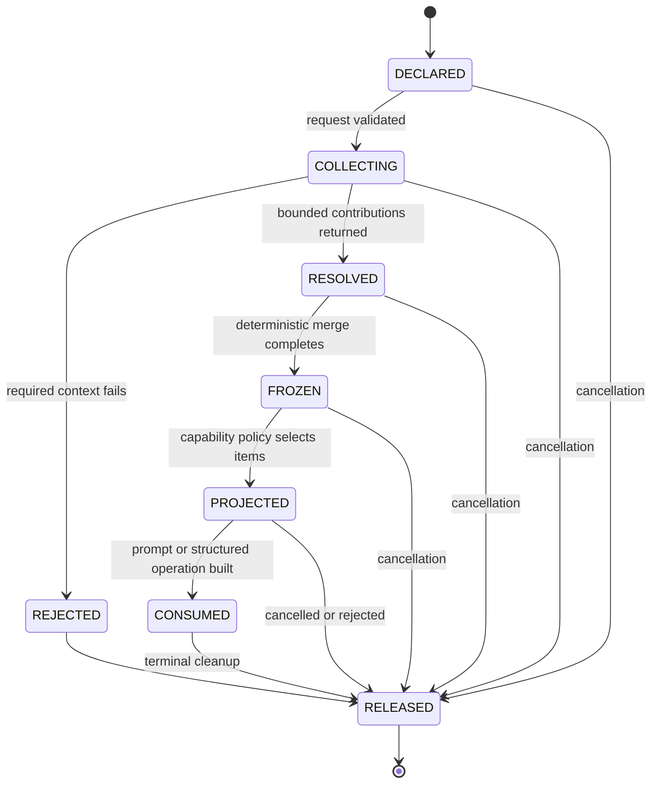
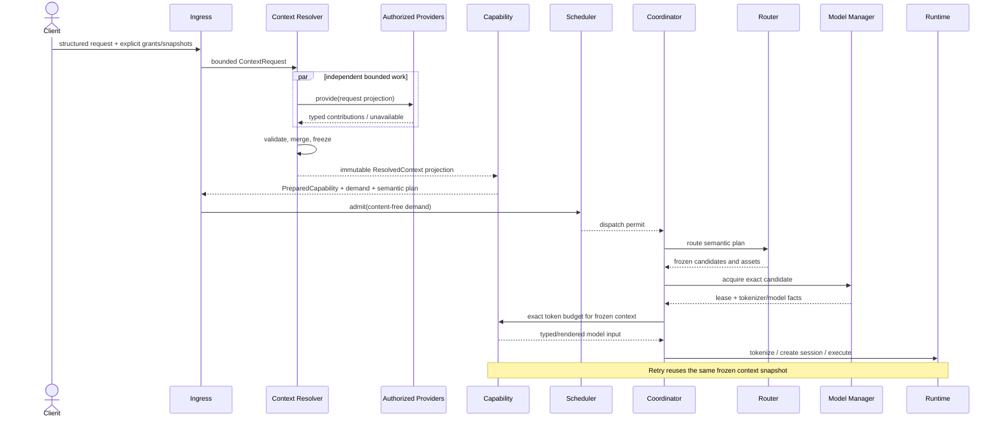

# Context Architecture Specification v1.0

**Status:** Stable — Context Architecture v1.0 (frozen 2026-07-15)

**Date:** 2026-07-13

**Baseline:** Platform Foundation v0.5, Execution Architecture v1.0, Capability
Framework v1.0, Model Manager Architecture v1.0, and Runtime v1.0

**Scope:** Request-scoped context architecture only. This document defines no keyboard,
UI, networking, retrieval, memory, or production capability implementation.

This specification defines how Touvay accepts, resolves, limits, and releases contextual
information used by capabilities. It refines the context-injection boundary in
`docs/capabilities/CAPABILITY_SPEC.md` and preserves the immutable, content-free
`ExecutionContext` required by ADR-017. ADR-013, ADR-017, ADR-019, ADR-020, and ADR-021
remain normative. ADR-022 and ADR-023 record this specification's cross-cutting
decisions. An accepted ADR wins if a conflict is discovered.

RFC 2119 terms (`MUST`, `SHOULD`, and `MAY`) are normative.

## 1. Goals

The context architecture must:

- give capabilities only the context explicitly authorized for the current request;
- preserve type, provenance, purpose, trust, and sensitivity instead of flattening
  context into an undifferentiated prompt string;
- keep user-bearing context out of `ExecutionContext`, Scheduler metadata, logs,
  diagnostics, catalog state, and model storage;
- bound provider work, retained bytes, items, and final model tokens;
- merge contributions deterministically regardless of provider completion order;
- freeze one request-scoped context view before execution so retry cannot observe a
  different clipboard, transcript, locale, or policy world;
- keep prompt instructions structurally separate from untrusted contextual data;
- support optional local retrieval and memory later without granting ambient authority
  or adding network access; and
- remain usable for future text, image, audio, and document capabilities.

## 2. Non-goals

Version 1 does not define or authorize:

- keyboard, IME, editor, accessibility, screen, contact, file, or system-clipboard
  collection;
- a public generic context map or generic prompt API;
- engine-owned durable conversation history;
- retrieval, embedding generation, vector storage, or indexing;
- durable memory, personalization, profiles, or cross-request learning;
- network-backed providers or remote context enrichment;
- model selection, runtime selection, scheduling policy, or prompt-format syntax;
- silent summarization or model-generated compression of context;
- persistence of user content, prompts, transcripts, or provider results; or
- implementation of a production capability.

The existing Capability Framework `CapabilityContext` is a bounded transport-neutral
container, not the complete semantic context model. Until a separately reviewed context
implementation exists, a capability may consume only explicitly named, policy-projected
values supplied by the composition root. Capability 1 must carry its required source
text in its versioned request schema and must not depend on an ambient provider.

## 3. Architectural boundaries

Context is a capability input concern, not execution metadata:

```text
explicit client inputs / trusted local facts
                    |
                    v
          bounded Context Providers
                    |
                    v
          Context Resolver + Merger
                    |
                    v
       immutable ResolvedContext snapshot
                    |
                    v
 Capability policy + exact token projection
                    |
                    v
 typed PromptRecipe data slots / structured operation
                    |
                    v
              Runtime input
```

The following boundaries are mandatory:

- `ExecutionContext` remains immutable and content-free under ADR-017. It may carry
  sizes, feature identifiers, policy generations, and limits, but never context values.
- `ResolvedContext` is the immutable request-scoped owner of content contributions. It
  is held by prepared capability state and released at terminal cleanup.
- Context Providers do not route, schedule, tokenize, render prompts, acquire models,
  create Runtime sessions, or publish output.
- Capability code declares requirements and consumes a narrow projection. It does not
  discover providers or request additional context during an attempt.
- The Scheduler sees content-free resource estimates only.
- Model Manager and Runtime receive no provider identity, application identity, consent
  token, or context provenance. Runtime receives only the final typed/rendered model
  input required for the attempt.
- The engine-service composition root is the only place concrete providers are wired.

No module gains a networking dependency through this architecture.

## 4. Context model

### 4.1 Context request

A `ContextRequest` is an immutable, request-scoped declaration derived from:

- the exact capability key and implementation revision;
- the capability's static `ContextPolicy`;
- explicit structured request fields and grants;
- authenticated principal and content-free policy facts; and
- hard item, byte, time, and provider-work ceilings.

It identifies requested context kinds and purposes but contains no prompt syntax. A
provider may return only a requested kind. Capabilities cannot enumerate installed
providers or use missing providers as a device fingerprint.

### 4.2 Context contribution

Every contribution has a typed envelope containing at least:

| Field | Contract |
|---|---|
| Local item ID | Stable only within the request; bounded and content-free. |
| Kind | Selection, conversation turn, clipboard snapshot, locale, app metadata, or a future registered kind. |
| Modality | Text initially; additive image, audio, and document handles later. |
| Purpose | Capability-declared reason the item may be used. |
| Provenance | Required internal `ContextProvenance` metadata identifying the origin category and bounded source facts. |
| Trust class | `TRUSTED_CONTROL`, `TRUSTED_FACT`, or `UNTRUSTED_DATA`. User-bearing items are always `UNTRUSTED_DATA`. |
| Sensitivity | At least `PUBLIC_FACT`, `APP_SCOPED`, `USER_CONTENT`, or `HIGH_SENSITIVITY`. This controls use, never logging permission. |
| Declared units | Bytes, Unicode scalar values, turns, segments, or modality-specific units. |
| Truncation policy | Atomic, head, tail, recent-first, segment-aware, or non-truncatable. |
| Effective requirement | Required/optional status assigned by the resolver from `ContextPolicy`; a provider cannot raise or lower it. |
| Freshness | Snapshot monotonic time and optional request-bounded expiry. |
| Payload | Immutable bounded value or future leased bulk handle. |

Byte arrays and collections are defensively copied or exposed through immutable bounded
views. Content-bearing classes MUST implement content-free `toString`, error, and debug
representations. Equality MUST NOT accidentally expose or compare mutable byte arrays.

### 4.3 Context provenance

Every context fragment records immutable `ContextProvenance` metadata. The initial
internal origin categories are:

| Origin | Meaning |
|---|---|
| `USER_SELECTION` | Content explicitly selected by the user for this operation. |
| `CLIPBOARD` | An explicitly supplied, request-scoped clipboard snapshot or grant. |
| `SYSTEM` | A trusted engine/device policy fact, never user content. |
| `CLIENT` | A value explicitly supplied by the authenticated client request. |
| `CONVERSATION` | A client-owned transcript fragment supplied for this request. |
| `RETRIEVAL` | A future result from an explicitly authorized local corpus. |
| `MEMORY` | A future result from an explicitly authorized memory store. |

Provenance also carries only the bounded internal facts required to enforce policy, such
as provider contract version, request-local source ID, capture time, and grant/purpose
identity. It never carries logging permission. Unknown origin values fail closed until
their version is understood.

`ContextProvenance` is an engine-internal type. Public AIDL, SDK, and capability wire
schemas do not expose provider IDs, resolver topology, grant implementation, storage
identity, retrieval implementation, or other engine details. A capability receives only
the minimum projection needed to enforce its approved `ContextPolicy`, normally origin
category, trust class, purpose, and request-local item identity. Public results and
errors contain no provenance unless a future capability contract separately justifies a
coarse user-facing source label.

### 4.4 Resolved context

`ResolvedContext` is an immutable ordered set of accepted contributions plus
content-free resolution facts:

- policy revision;
- internal provider-result status by provider ID;
- retained item/byte counts;
- omitted optional-kind identifiers; and
- a request-local snapshot identity that is never persisted or exposed publicly.

It does not contain prompts, model tokens, model/runtime identity, Scheduler state, or
attempt state. Retry and fallback reuse the same resolved snapshot. Context Providers
MUST NOT run again during an `ExecutionAttempt`.

Provider status is resolver diagnostics only; capability projections expose requested
kind presence/absence, not an inventory of installed providers.

### 4.5 Context lifecycle



`FROZEN` forbids provider calls and contribution mutation. Exact token projection may be
recomputed for a frozen plan binding, but it may only select or truncate the already
frozen items. It may not fetch, infer, or synthesize additional context.

## 5. Context Provider contract

A Context Provider is an internal port with:

- a stable provider ID and provider contract version;
- the exact context kinds it can produce;
- hard per-call item, byte, and work limits;
- a cancellable `provide` operation receiving a narrow `ContextRequest` projection;
- a typed result: contributions, optional unavailable, required failure, or cancelled;
  and
- no authority beyond objects explicitly passed into the call.

Provider implementations MUST:

- be deterministic for the same supplied snapshot and policy where their source permits;
- return immutable contributions within declared bounds;
- check cancellation before and during material work;
- finish within an engine-owned monotonic deadline;
- avoid Binder, typing, UI, and Runtime threads;
- never log content or include it in exceptions;
- never retain content after the request releases its snapshot; and
- never access network services.

The resolver may invoke independent providers concurrently on bounded worker lanes. The
merge order is based on registered provider order and item keys, never completion order.
A hung or hostile provider is cancelled at its deadline and cannot block typing or
unboundedly delay request admission.

Provider registration is immutable after composition. Duplicate provider IDs or
ambiguous ownership of an exclusive context kind are composition errors.

## 6. Context ownership

| Resource | Owner | Lifetime and release |
|---|---|---|
| Public request payload / bulk handle | Transport ingress or capability payload owner | Snapshot/lease through bounded preparation; released at request terminal. |
| `ExecutionContext` | Execution Coordinator | Content-free, immutable, request lifetime. |
| Provider source snapshot | Concrete provider adapter | Captured explicitly, request-scoped, released after contribution materialization or terminal cleanup. |
| `ResolvedContext` | Prepared capability state | Immutable request snapshot; closed after all attempts or earlier terminal result. |
| Context projection | Capability attempt | Borrowed from frozen context; released before prepared state. |
| Prompt/model input buffers | Capability attempt / Coordinator | Attempt-scoped; closed before model lease. |
| Model lease and Runtime session | Execution attempt | Unchanged by context design; reverse-order cleanup remains normative. |

Providers return values; they do not transfer ambient authority. A bulk contribution
uses an explicit lease with one owner and bounded borrowed readers. A capability never
closes a transport- or provider-owned descriptor directly.

Kotlin/JVM cannot guarantee physical zeroization of immutable strings. The production
requirement is therefore to minimize copies, avoid process-wide caches and interned
content, clear mutable byte buffers where practical, release references deterministically,
and rely on process-private memory and process death for final reclamation.

## 7. Selection context

Selection context represents the exact user-authorized subject of an operation. It is
not equivalent to ambient editor state.

A selection contribution includes:

- the selected text or future leased segment;
- a request-local source/segment ID;
- the offset unit when offsets are meaningful;
- optional bounded offsets relative to an explicitly supplied parent snapshot;
- declared language/locale when supplied by the client; and
- provenance identifying the explicit request field or grant.

Selection is normally mandatory for a selection-oriented capability and receives the
highest content budget after trusted control and output reservation. The engine does not
read surrounding editor text to complete it. Surrounding text, composing text, cursor
state, and editor metadata are separate future context kinds requiring an approved
keyboard/IME contract.

For Capability 1 (`text.rewrite@1`), source text MUST be a required structured request
field. Treating it as an optional selection provider would make correctness depend on
an unimplemented ambient integration and is forbidden.

## 8. Conversation context

Conversation context is an explicit, client-supplied bounded list of turns for the
current request. Each turn has:

- a request-local turn ID;
- a typed role from the capability schema, never a free-form instruction role;
- content and modality;
- ordering information;
- optional client-declared locale; and
- provenance and sensitivity metadata.

All client-supplied turns are untrusted data, including text labelled as “system” by an
external source. A capability decides which supported roles map to which data slots;
clients cannot create trusted prompt instructions.

ADR-019 remains unchanged: the client owns the logical transcript and resupplies the
needed bounded window on each request. An opaque conversation ID may support client-side
organization or coalescing, but it is not a durable engine session and does not authorize
the engine to recover prior turns. The engine persists no transcript or KV cache.

Conversation budgeting is deterministic: retain mandatory anchor turns first if the
capability defines them, then select recent complete turns newest-to-oldest while
preserving their final chronological order. Partial turn truncation is permitted only
when the capability schema and policy explicitly allow it.

## 9. Clipboard context

Clipboard context is disabled by default. Engine code and Context Providers MUST NOT
read the Android system clipboard ambiently.

A future client may supply a clipboard snapshot only through an explicit request field
or narrowly scoped grant. The snapshot must include:

- a supported MIME/content type;
- bounded content or an explicit bulk lease;
- snapshot time and request-bounded expiry;
- provenance showing explicit client authorization; and
- a purpose matching the requested capability.

Clipboard content is `USER_CONTENT` or `HIGH_SENSITIVITY`, always untrusted data, never
cached across requests, never used for capability discovery/model selection, and
released at terminal cleanup. A capability that does not declare clipboard context
cannot receive it. Missing optional clipboard content is not inferred from device state.

## 10. Locale

Locale context distinguishes three facts:

1. requested output locale, explicitly selected by the request;
2. source/input locale, explicitly declared or capability-detected under a documented
   deterministic policy; and
3. UI/device fallback locale, a trusted content-free fact supplied by engine policy.

Locale identifiers use canonical BCP 47 language tags. Invalid, private-use, or overly
long tags are rejected or normalized only according to the capability's versioned
contract. Precedence is:

```text
explicit request locale > explicit selection/turn locale > capability-approved local
detection > engine policy fallback > capability-defined neutral behavior
```

Locale is never inferred from an app package name, label, account, network location, or
clipboard. Detection results are request-scoped and are not persisted as a user profile.

## 11. App metadata

Application authentication facts remain inside transport/security policy and are not
automatically capability context. Raw UID, package name, signing identity, application
label, window title, field identifier, contact identity, and account identity MUST NOT
enter a prompt or be exposed to capability code.

An approved capability may request a minimal allowlisted semantic fact when it changes
correctness, for example a coarse input mode or content category explicitly supplied by
the client. Such facts must:

- have a versioned finite enum rather than arbitrary strings;
- be purpose-bound to the capability;
- omit stable cross-app/user identifiers;
- be excluded from logs and telemetry; and
- never alter authentication or authorization.

Unknown values map to an explicit neutral enum. Application metadata MUST NOT be used to
personalize model output, select a higher-privilege prompt, or create a cross-request
profile without a separately approved privacy architecture.

## 12. Context policy and requirements

Every capability contract declares a static `ContextPolicy` containing:

- supported and required context kinds;
- accepted modalities and schema revisions;
- allowed purposes and sensitivity ceiling;
- per-kind item, byte, and token limits;
- merge rank and truncation policy;
- whether absence is allowed;
- whether the capability may perform deterministic local language detection; and
- the named recipe/structured-operation slots that may consume each kind.

Policy is code-owned and versioned with the capability implementation. Clients cannot
relax it, convert optional context into instructions, or raise limits. Device policy may
further reduce allowed context but cannot silently make a required context optional.

Preparation fails before admission with a typed content-free error when required context
is absent, malformed, expired, unauthorized, or over its non-truncatable limit.

## 13. Deterministic context merging

The resolver performs these steps in order:

1. validate the capability's static context policy;
2. intersect requested kinds with client grants and engine privacy policy;
3. invoke only the authorized providers with hard deadlines and bounds;
4. validate every returned envelope and payload size;
5. sort by capability merge rank, registered provider rank, kind, and local item ID;
6. reject duplicate exclusive items and deduplicate permitted repeats using
   request-ephemeral keys;
7. resolve typed fact conflicts using declared precedence, never “last completed wins”;
8. record optional omissions without inventing empty content;
9. freeze the ordered `ResolvedContext`; and
10. release provider snapshots no longer needed.

Text from different items is never silently concatenated. Prompt construction receives
typed items and explicit slots. If deduplication uses a content digest, the digest is
request-local, memory-only, keyed where practical, and released with the context; it is
never logged or persisted.

Conflicting required exclusive facts fail deterministically. Conflicting optional facts
select the documented higher-precedence source and record only a content-free diagnostic
reason code.

## 14. Token budgeting

Context has byte/item admission bounds before a model is selected and exact token bounds
after a plan binding and tokenizer are available. Byte estimates MUST NOT be presented
as exact token counts.

For one attempt binding:

```text
usable input tokens = model context limit
                    - trusted recipe/control tokens
                    - reserved output tokens
                    - model-format/special-token overhead
                    - safety margin
```

The capability assigns the usable context budget deterministically by policy. The
default priority is:

1. non-truncatable trusted control and output schema;
2. required primary input/selection;
3. required typed facts;
4. conversation anchor turns and then recent complete turns;
5. explicitly supplied optional context such as clipboard;
6. future retrieval results; and
7. future memory hints.

The exact order may differ only in a versioned capability policy with tests. Budgeting
MUST:

- use the exact Runtime tokenizer selected by the frozen candidate;
- validate the final fully rendered model input as one token sequence rather than
  treating the sum of separately tokenized fragments as exact;
- preserve Unicode and capability offset rules;
- truncate only at policy-approved item/segment/turn boundaries;
- never drop mandatory non-truncatable input silently;
- never call a model to summarize context implicitly;
- produce the same projection for equal frozen input, policy, tokenizer, and limit;
- remain bounded in CPU, allocations, items, and tokenizer calls; and
- fail with a typed input/context-limit error when no valid projection fits.

An implementation may use per-item estimates to choose an initial projection, but the
commit check tokenizes the fully rendered candidate input. If it does not fit, the
capability applies its deterministic truncation order, rerenders, and retokenizes within
a hard iteration bound. A control-only prompt that already exceeds the model limit is a
pack/capability compatibility failure, not a reason to remove trusted constraints.

Fallback candidates may tokenize differently. Each attempt may compute a different
valid projection from the same frozen `ResolvedContext`, but may not rerun providers or
change semantic priority. Any capability whose semantics require byte-identical context
across candidates must declare fallback unsafe.

## 15. Two-phase execution interaction

Context resolution is deliberately split from token projection:



Collection happens before capability preparation because context can affect validation,
demand, and semantic planning. Exact token projection happens after model acquisition
because only then is the tokenizer authoritative. Provider work is not repeated after
admission or routing.

Provider deadlines are part of pre-admission validation. Slow provider work cannot hold
a Scheduler reservation, model lease, Runtime instance, or session.

## 16. Failure handling

| Failure | Required behavior |
|---|---|
| Optional provider unavailable/timeout | Record content-free omission and continue if policy permits. |
| Required provider unavailable/timeout | Reject before admission with typed unavailable/context error. |
| Malformed or oversized contribution | Reject provider result; fail only if required. |
| Unauthorized kind or purpose | Security/policy rejection; never downgrade silently. |
| Required context exceeds budget | Typed context-limit failure; no partial semantic execution. |
| Optional context exceeds budget | Deterministically truncate/drop by policy. |
| Cancellation during collection | Stop providers, release snapshots, publish cancellation through normal terminal arbitration. |
| Provider exception | Convert at boundary to a static reason code; discard message and type from public output. |
| Tokenizer/candidate incompatibility | Candidate fails before commit; existing frozen-plan retry rules apply. |
| Invariant or ownership mismatch | Fail closed, release all context, and emit only a content-free local incident ID where supported. |

Context failures never include content, app identifiers, provider exception messages,
paths, clipboard types, transcript fragments, or locale strings in public errors or
diagnostic records.

## 17. Future retrieval hooks

Retrieval is a future provider family, not an implicit feature of prompt construction.
No retrieval implementation is authorized in v1.

Any future retrieval port must require a new approved design covering:

- offline-only source registration and trust verification;
- explicit per-request corpus authorization and principal isolation;
- bounded query derivation without logging the query;
- immutable result provenance and optional citation identifiers;
- item, byte, latency, compute, and exact token budgets;
- cancellation and deterministic ranking/tie-breaking;
- stale-index and source-deletion behavior;
- index encryption, deletion, and crash consistency; and
- security tests for prompt injection and cross-corpus leakage.

Retrieval results are untrusted data even when the local corpus is signed. They cannot
create trusted instructions. A provider may expose content only from an explicitly
authorized local corpus; it cannot access the network through another module.

## 18. Future memory hooks

Memory is distinct from client-owned conversation context. No memory implementation is
authorized in v1.

Any future memory provider requires explicit opt-in and a separate architecture/ADR
covering:

- what may be written, by whom, and for which declared purpose;
- per-principal and per-application isolation;
- encryption at rest and key lifecycle;
- provenance, confidence, expiry, correction, export, and deletion;
- user-visible controls and complete reset;
- prevention of silent model-generated “facts” becoming trusted memory;
- bounded storage and eviction;
- process-death/crash recovery; and
- conformance tests against cross-user, cross-app, and stale-memory disclosure.

There is no global cross-application memory. Memory values remain untrusted data when
used by a prompt unless a future narrowly scoped fact type is separately approved.

## 19. Privacy and security model

The context architecture follows data minimization, explicit authorization, purpose
binding, least privilege, isolation, and bounded retention.

Mandatory rules:

- no ambient collection;
- no network access or telemetry;
- no content in logs, metrics, traces, exception messages, incident records, crash
  breadcrumbs, `toString`, model/catalog metadata, or Scheduler state;
- no persistence or cross-request cache of content;
- no cross-principal sharing, deduplication, coalescing, or provider snapshots;
- no user/context data in trusted prompt control roles;
- no provider access to unrelated request payloads;
- no raw application identity in capability or Runtime inputs;
- release all references at terminal cleanup and cancel provider work on client death;
- fail closed when grant, provenance, sensitivity, or ownership is ambiguous; and
- keep public errors static, typed, and content-free.

Prompt-injection resistance is structural, not based on filtering phrases. User,
clipboard, transcript, retrieval, and future memory content remain typed untrusted data
through recipe construction and model-family rendering. Output still requires
capability-specific validation and must never be treated as trusted code or policy.

## 20. Performance and threading

- Context resolution never executes on Binder, Android main, keyboard/typing, Runtime
  inference, or Runtime callback threads.
- Provider fan-out is bounded by a small engine-owned concurrency limit.
- Every provider has item, byte, allocation/work, and monotonic time ceilings.
- Providers capture immutable snapshots; they do not hold platform locks while parsing
  or waiting.
- Merge is linear or `O(n log n)` over a hard-bounded item count and deterministic.
- Tokenization is deferred until an exact candidate exists and uses bounded calls;
  repeated candidate projections may cache only attempt/request-local token counts.
- Context resolution occurs before Scheduler resource admission so optional enrichment
  cannot consume scarce model/KV reservations.
- Cancellation is checked between provider, merge, projection, and rendering stages.
- No context operation may block typing; client/keyboard integration, when designed,
  must snapshot explicitly and submit asynchronously.

## 21. Testing strategy

A future Context conformance suite must include:

### Model and provider tests

- immutable defensive copies and content-free representations;
- provider registration uniqueness and exclusive-kind ownership;
- requested-kind/purpose enforcement and least-privilege projections;
- item, byte, depth, Unicode, and malformed-envelope bounds;
- provider deadline, cancellation, exception, and late-result behavior;
- no provider execution on forbidden thread classes; and
- fuzz/property tests for contribution validation.

### Merge and budgeting tests

- deterministic output under every provider completion permutation;
- precedence, conflict, omission, and duplicate handling;
- selection, conversation, clipboard, locale, and app-metadata policies;
- exact tokenizer accounting, special-token overhead, output reservation, and margins;
- atomic/segment/turn-aware truncation and Unicode/offset preservation;
- different-tokenizer fallback projections from one frozen snapshot;
- failure when mandatory content cannot fit; and
- bounded complexity at maximum permitted sizes.

### Lifecycle and security tests

- cancellation at every lifecycle boundary and deterministic release;
- retry never reruns providers and cannot observe changed source state;
- cross-principal/provider/cache isolation under concurrency;
- explicit proof that the engine never reads the system clipboard ambiently;
- hostile provider and payload sentinels never reaching logs, errors, diagnostics,
  Scheduler facts, catalog state, or model metadata;
- no retained context after terminal cleanup using weak-reference/leak harnesses where
  deterministic;
- prompt-role tests proving untrusted values cannot become control instructions;
- process death requiring client reconstruction, not context recovery; and
- future retrieval/memory security suites before either hook is enabled.

Capability conformance tests additionally verify each capability's declared
`ContextPolicy`, required/optional behavior, merge ranks, truncation rules, recipe slot
mapping, and content-free failures. Capability 1 must test that rewrite source text is
explicit, bounded, treated as untrusted data, and independent of clipboard/IME state.

## 22. Compatibility and versioning

Context kinds, provider contracts, policies, and contribution schemas are versioned
independently from capability wire schemas. Additive optional fields are permitted when
older consumers can safely ignore them. Meaning changes, trust-class changes, or weaker
privacy behavior require a new version and architecture review.

Provider availability is not a public compatibility promise. A capability schema must
remain deterministic when optional providers are absent. A required provider becomes
part of that capability implementation's availability contract and must be represented
in discovery without revealing device-sensitive details.

The current map-backed `CapabilityContext` may serve as an adapter for a small set of
approved text projections. It MUST NOT become a public API or generic bag of ambient
values. A richer internal context type can replace the adapter additively behind the
Capability SPI after this specification is approved and an implementation slice is
authorized.

## 23. Accepted ADRs

The following cross-cutting decisions are accepted with Context Architecture v1.0:

### ADR-022 — Explicit request-scoped context providers and provenance

Providers have no ambient authority; `ExecutionContext` remains
content-free; user-bearing context lives in one immutable request snapshot; provider
collection occurs before preparation/admission; retry never reruns providers; and every
fragment carries internal typed provenance metadata that is minimized at public
boundaries.

Alternatives rejected by this proposal: ambient engine reads, mutable shared context,
provider lookup from capability code, or attempt-time provider calls.

### ADR-023 — Deterministic merge and exact token budgeting

Typed contributions, deterministic precedence independent of completion order,
structural separation of instructions and untrusted data, pre-route byte bounds, and
post-route exact tokenizer budgeting against the frozen snapshot.

Alternatives rejected by this proposal: raw string concatenation, byte-to-token guesses,
silent model summarization, completion-order merge, or rerouting after context overflow.

## 24. Initial implementation gate

Context Architecture v1.0 and ADR-022/023 are approved. Capability 1 Rewrite is
authorized with these constraints:

1. Capability 1 may define `text.rewrite@1`, its wire schemas, semantic execution plan,
   signed prompt assets, deterministic post-processing, and Capability TCK profile.
2. Rewrite required source text remains in its explicit structured request schema.
3. Rewrite must not read keyboard, IME, clipboard, app identity, retrieval, memory, UI,
   or network state.
4. A general Context Provider/Resolver implementation requires an explicitly authorized
   slice; it is not implied by approval of Rewrite.
5. Public AIDL/SDK changes, if any, require a separately reviewed additive API proposal
   and BCV/API validation.

General Context Provider/Resolver production code remains outside the Rewrite scope.
