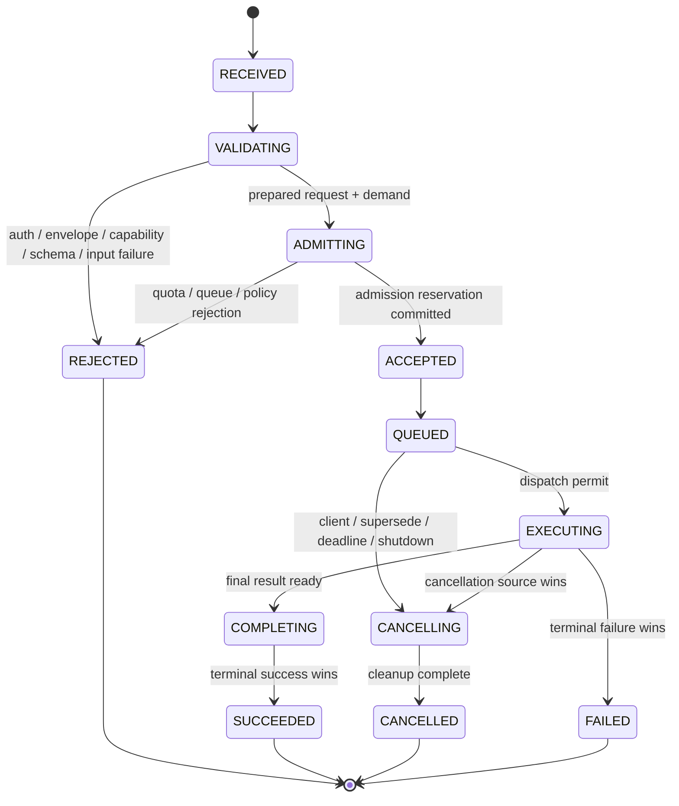
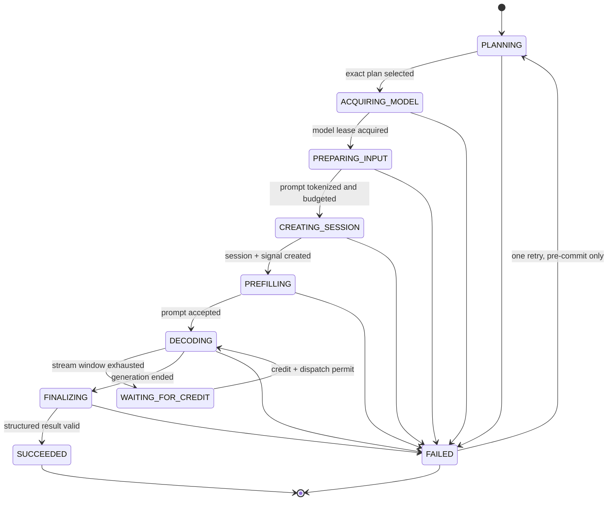
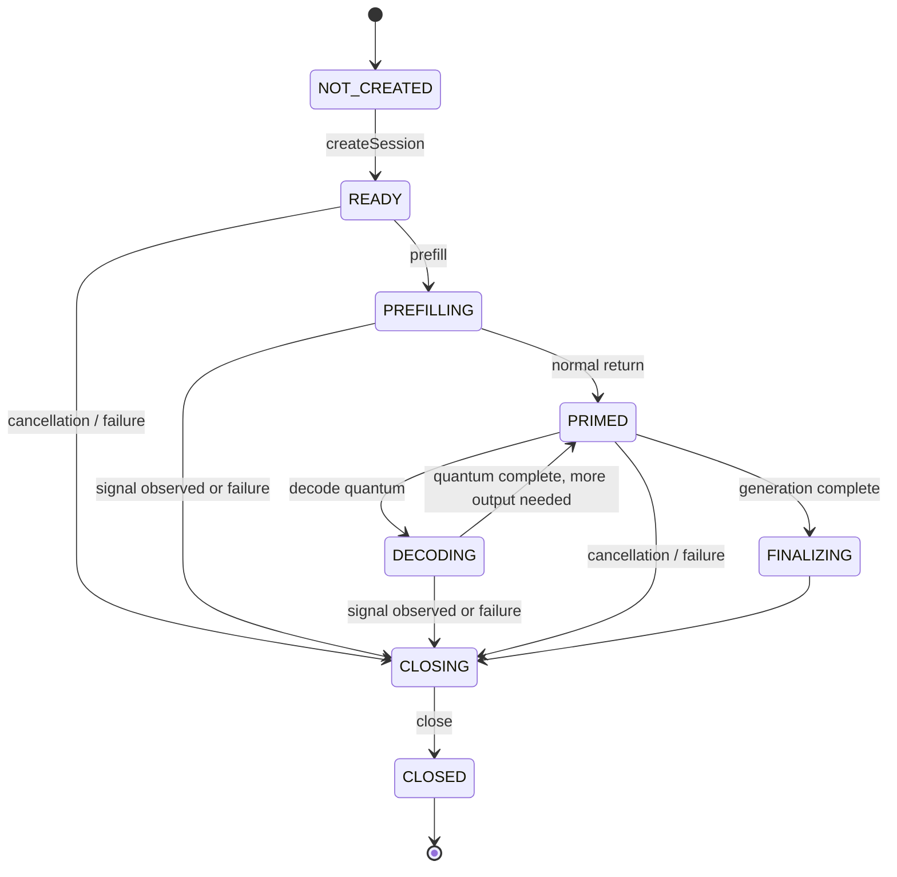
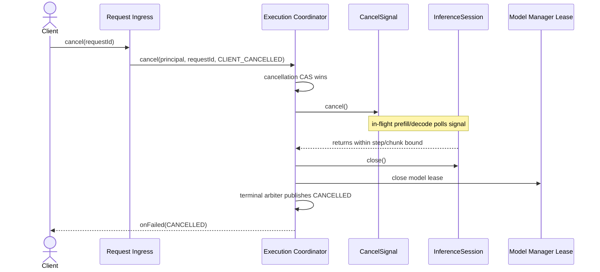
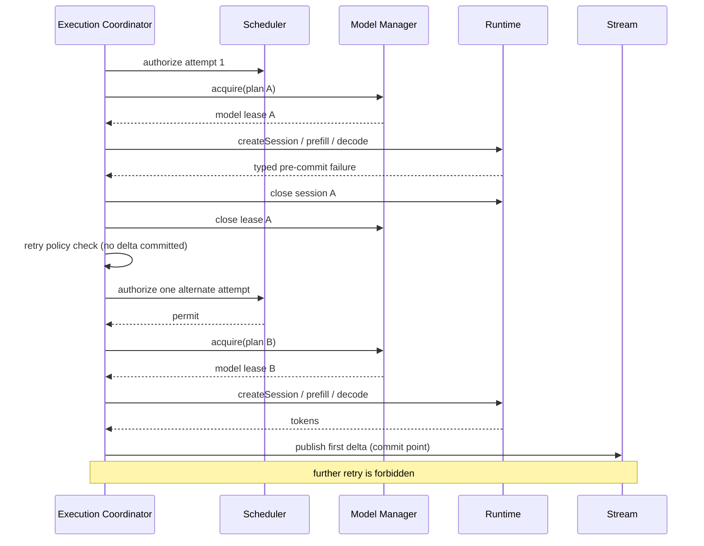
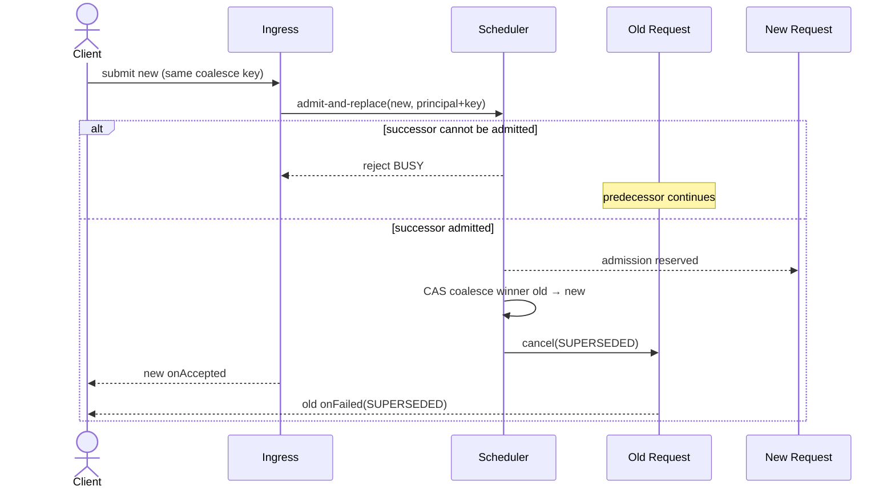
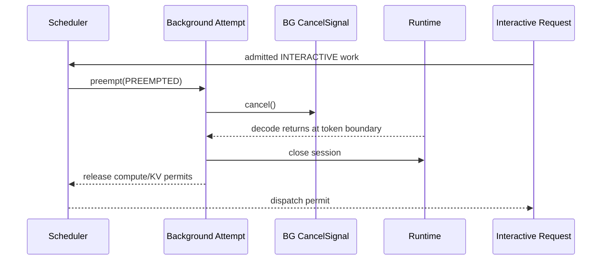
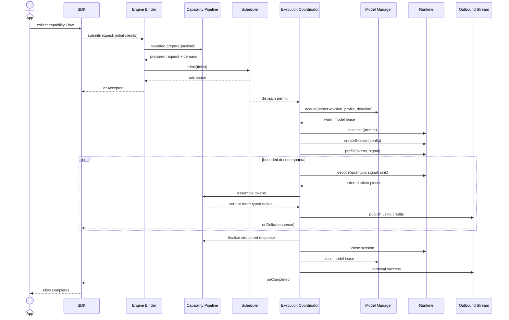
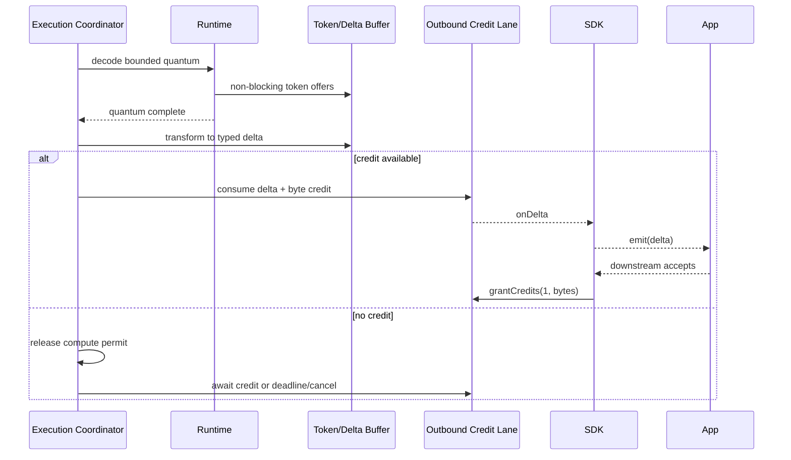
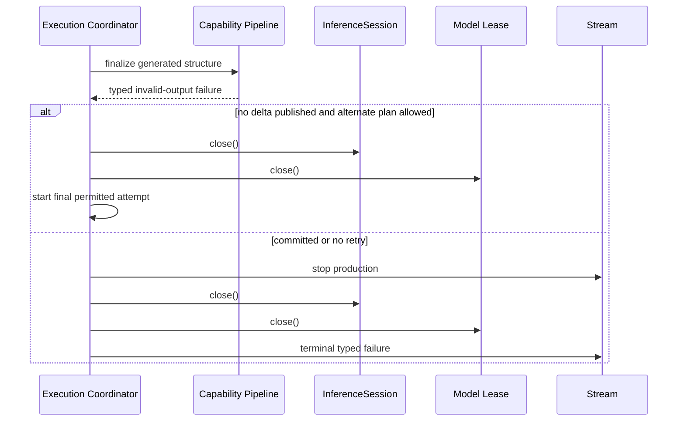

# Execution Architecture Specification v1.0

**Status:** Stable — Execution Architecture v1.0 (frozen 2026-07-15)

**Date:** 2026-07-13

**Baseline:** Runtime v1.0 Foundation and Model Manager Slices 1–4

**Scope:** Frozen engine request-orchestration contract for Milestone 5 implementation

**Decisions:** [ADR-017](../adr/ADR-017-execution-coordinator-and-terminal-semantics.md),
[ADR-018](../adr/ADR-018-credit-based-streaming.md), and
[ADR-019](../adr/ADR-019-logical-conversations-and-runtime-sessions.md)

This specification defines how an admitted capability request becomes one or more
bounded execution attempts, borrows a loaded model, owns a runtime session, streams
results, handles cancellation, and terminates exactly once. It refines
`docs/ARCHITECTURE.md` sections 9–14, ADR-010, ADR-012, ADR-015, the Runtime SPI v1
specification, and Model Manager Architecture v1.0. On conflict with an accepted ADR or
the Runtime SPI, the accepted record or SPI wins until the conflict is explicitly
reviewed.

RFC 2119 terms (`MUST`, `SHOULD`, `MAY`) are normative.

## 1. Goals

- Keep Binder, SDK, routing, scheduling, capability behavior, model ownership, and
  runtime mechanics separated by narrow ports.
- Guarantee exactly one terminal outcome per submitted request that reaches the engine.
- Keep typing and Binder threads free of routing, storage, model, and inference work.
- Make cancellation race-safe from queue admission through native decode.
- Bound every queue and user-content buffer; slow clients must not exhaust the engine.
- Preserve request ordering, stream ordering, mmap safety, and reverse-order cleanup.
- Support cold loads, multiple models, alternate execution plans, and future modalities
  without changing the request lifecycle vocabulary.
- Keep all public errors typed and content-free.

## 2. Non-goals

- Implementing the Scheduler, router, capability pipelines, sessions, or engine wiring.
- Changing Runtime SPI v1 or Model Manager ownership.
- Adding cloud inference, networking, downloader behavior, or telemetry.
- Persisting prompts, transcripts, runtime sessions, KV state, or request queues.
- Defining capability-specific prompts, schemas, quality policy, or truncation rules.
- Adding pause/resume or KV snapshot preemption. ADR-010 cancellation remains the v1
  preemption mechanism.
- Defining implementation outside the separately authorized Milestone 5 scope.

## 3. Terms and component boundaries

| Term | Meaning |
|---|---|
| **Request** | One authenticated client operation identified by `(client principal, requestId)`. It owns the public callback lifecycle. |
| **Execution context** | Immutable, content-free metadata shared by every layer for one request. It is created once after ingress validation and never carries mutable lifecycle state. |
| **Prepared request** | Bounded, capability-owned parsed state plus routing and resource demand; never persisted. |
| **Execution ticket** | Payload-free scheduling metadata for one admitted request. |
| **Execution attempt** | One concrete plan try under a request. A request may have at most two attempts in v1. |
| **Execution plan** | Immutable, dispatch-time routing result containing the primary candidate and any ordered, retry-safe fallback candidate. It is not an attempt and owns no runtime resources. |
| **Model lease** | Model Manager lease borrowing one cached `ModelInstance` and pinning its exact revision indirectly. |
| **Runtime session** | One request-attempt-scoped `InferenceSession` and its KV state. |
| **Logical conversation** | Client-owned transcript/context identity. It is not a runtime session and is reconstructible after process death. |
| **Stream commit point** | Publication of the first client-visible response delta. Internal retry is forbidden after this point. |
| **Terminal arbiter** | Per-request atomic owner that permits exactly one success or failure publication. |

The production flow is:

```text
SDK / Binder
    │ authenticated envelope + callback
    ▼
Request Ingress ── validation, identity, bounded copy
    │
    ▼
Capability Registry / Pipeline ── prepare opaque capability work
    │ routing demand + resource facts; no runtime objects
    ▼
Router ── candidate plan facts; exact plan revalidated at dispatch
    │
    ▼
Scheduler ── admission, priority, queue, deadline, permits, preemption
    │ dispatch permit
    ▼
Execution Coordinator ── attempts, cancellation, stream, cleanup, terminal outcome
    ├── Model Manager ── exact model lease / instance ownership
    ├── Runtime SPI ── tokenize / request-scoped session / prefill / decode
    └── Capability hooks ── prompt, truncation, token assembly, structured final result
```

Dependency direction remains unchanged:

- `engine-core` owns orchestration abstractions and pure policy state;
- `engine-models` implements its existing internal Model Manager boundary and does not
  depend on `engine-core`;
- `engine-service` is the composition root and adapts Binder, Model Manager, device, and
  concrete pipelines to `engine-core` ports;
- concrete runtimes remain visible only at composition through the Runtime Registry;
- capability wire schemas remain owned by `touvay-contract` under ADR-014.

## 4. Global execution invariants

- **EXE-INV-1:** A request publishes at most one `onAccepted`, zero or more ordered
  deltas, and exactly one terminal callback. Pre-admission rejection publishes only the
  terminal failure.
- **EXE-INV-2:** `onAccepted` means validation completed and Scheduler admission was
  reserved. It does not mean execution started or the model is warm.
- **EXE-INV-3:** No delta occurs before `onAccepted`; no callback occurs after the
  terminal callback.
- **EXE-INV-4:** Request state is keyed by authenticated client principal plus request
  id. Raw request ids never authorize cross-principal cancellation.
- **EXE-INV-5:** Every queue and user-content buffer has both item and byte bounds.
- **EXE-INV-6:** An execution attempt owns at most one runtime session and one model
  lease. It closes the session before the model lease.
- **EXE-INV-7:** Runtime session calls are serialized. After cancellation may have been
  observed, only `session.close()` is legal.
- **EXE-INV-8:** The Scheduler owns policy; the Execution Coordinator owns mechanics.
  Neither Model Manager nor capability code reorders requests.
- **EXE-INV-9:** No arbitrary downstream exception message crosses Binder, enters a
  public error, or reaches a diagnostic record.
- **EXE-INV-10:** Once the first delta is published, the request never retries or changes
  execution plan.
- **EXE-INV-11:** Process death requires no execution recovery. The SDK fails in-flight
  work and the client explicitly reconstructs logical state.
- **EXE-INV-12:** User payload, prompts, token pieces, parsed capability state, and
  transcripts are memory-only and are released when their request terminates.
- **EXE-INV-13:** One immutable `ExecutionContext` is created per request and shared by
  reference. Mutable state, content, leases, sessions, attempts, and counters never enter it.
- **EXE-INV-14:** Routing produces one immutable `ExecutionPlan` before attempt 1.
  Retry selects the next precomputed candidate from that plan and never invokes routing again.

## 5. Request lifecycle

### 5.1 State machine



`REJECTED`, `SUCCEEDED`, `CANCELLED`, and `FAILED` are terminal. `REJECTED` is a
pre-admission terminal result and therefore has no preceding `onAccepted`.

### 5.2 Ingress and validation order

Request ingress MUST perform cheap checks in this order:

1. capture the authenticated Binder principal before leaving the Binder thread;
2. validate envelope nullability, contract version, request-id grammar/length, declared
   priority, coalesce-key bounds, and inline/bulk payload size;
3. establish `(principal, requestId)` uniqueness among live requests;
4. defensively snapshot retained inline bytes or take an explicit bulk-input lease;
5. resolve capability id and schema version;
6. invoke the capability's bounded parser/validator off Binder threads;
7. derive payload-free routing demand and Scheduler resource estimates;
8. request atomic admission; and
9. publish `onAccepted` only after admission succeeds.

Authentication failures remain Binder security failures and disclose no request state.
All other failures for an authenticated callback-capable request use its terminal
callback. Request-id uniqueness is scoped to the authenticated principal; a completed id
may be reused because the engine retains no request history, though SDKs MUST generate
unguessable unique ids per connection.

### 5.3 Terminal arbitration

One atomic terminal arbiter is created before admission. Success, validation failure,
runtime failure, cancellation, client death, deadline, and shutdown all compete through
that arbiter. The winner owns final stream closure and callback publication; losing
paths perform only idempotent cleanup. Terminal callbacks are serialized through the
request's outbound lane.

If cancellation races success:

- success wins if the terminal success was committed first;
- cancellation wins if it was recorded before terminal success;
- a token produced internally but not published does not make success win;
- cancellation after the request leaves the live map returns "unknown/already done" and
  changes nothing.

### 5.4 Immutable execution context

After authenticated ingress validation, the engine creates exactly one immutable
`ExecutionContext`. It is the canonical carrier for per-request execution metadata and
is passed, or projected into narrower views, instead of rebuilding loosely related
parameter lists at each boundary.

The context contains:

- authenticated `RequestKey` (`principal` plus request id);
- capability id and request schema version;
- engine-clamped priority and opaque/hashed coalescing identity;
- monotonic received, admitted, and absolute-deadline values where known;
- negotiated contract and streaming feature set;
- immutable payload-size and bulk-input-size facts, never payload bytes;
- quota/policy bucket and device-policy generation used for admission;
- local content-free correlation/incident identity; and
- immutable request limits such as maximum output units and stream window ceilings.

The context never contains payload bytes, parsed user content, prompts, transcripts,
token pieces, callback objects, cancellation flags, lifecycle state, counters, Scheduler
permits, model identities, leases, Runtime objects, sessions, or attempt failures. Those
belong to the mutable `RequestRecord`, prepared capability state, `ExecutionPlan`, or
current `ExecutionAttempt`.

Creation is two-stage without mutation: ingress creates a validated context candidate;
successful admission returns a final context containing the admitted timestamp and
policy snapshot. Pre-admission failures retain only the candidate long enough to publish
their terminal result. Retry and fallback reuse the same final context.

## 6. Execution lifecycle

An accepted request owns one mutable `ExecutionRecord`, one immutable `ExecutionPlan`,
and one or two sequential `ExecutionAttempt` objects.



The Scheduler admits a request using a conservative `ExecutionDemand`. Routing compiles
the exact immutable plan only when the first dispatch begins so activation, rollback,
runtime availability, thermal policy, and loaded-instance affinity are current. A plan
contains:

- exact capability id/schema implementation;
- an ordered primary candidate and at most one retry-safe fallback candidate in v1;
- for each candidate, exact model revision selection or an atomic Model Manager selector;
- each candidate's `ExecutionProfileRequest`;
- required typed Runtime features;
- context and decode limits;
- declared fixed/KV resource estimates;
- the failure classes that authorize moving to the fallback candidate; and
- capability-owned pack configuration/template identity.

The Coordinator MUST NOT retain an exact plan while queued if the underlying catalog or
policy generation changes. It compiles/revalidates immediately before attempt 1, then
freezes the plan. An `ExecutionAttempt` selects exactly one candidate by index and owns
its session, model lease, cancel signal, buffers, permits, assembler, timing, and failure.
It cannot mutate the plan. A retry closes attempt 1 and creates attempt 2 from the
already-ranked fallback candidate; it does not call the Router again. If the fallback is
no longer valid when acquired, retry fails rather than silently rerouting.

## 7. Session lifecycle

### 7.1 Runtime session state

Runtime sessions are attempt-scoped in v1:



The execution order is normative:

1. acquire the model lease;
2. build the engine-owned prompt and tokenize through `ModelInstance.tokenize`;
3. apply capability-specific truncation and enforce context/KV admission;
4. re-check cancellation and deadline;
5. create one `InferenceSession` and one fresh `AtomicCancelSignal`;
6. prefill;
7. decode in bounded quanta;
8. finalize capability output;
9. close the session; and
10. close the model lease.

Tokenization occurs before session allocation so oversized input fails without allocating
KV. The Coordinator calls no session operation concurrently. A set cancellation signal
is never cleared or reused. If cancellation is set while a call might observe it, the
only subsequent session call is `close`, as required by SPI-LC-9.

### 7.2 Logical conversations

A logical multi-turn conversation is client-owned transcript state, not an
`InferenceSession`. Runtime sessions remain process-local and request-scoped. After
engine death, the client reconnects and resubmits the required transcript; the engine
re-prefills. A future ephemeral session optimization MAY be added only behind an
additive contract and must retain transcript-based reconstruction as the correctness
path. No runtime session, KV cache, or prompt is persisted.

## 8. Streaming lifecycle and backpressure

### 8.1 Three distinct streams

Execution must not conflate:

1. runtime tokens (`tokenId`, UTF-8 piece);
2. capability deltas (typed capability response payloads); and
3. Binder `ResponseDelta` envelopes with request sequence numbers.

The runtime token sink never calls Binder and never performs parsing, I/O, logging, or a
suspending operation. Capability code may buffer tokens until it can emit a meaningful
typed delta. Sequence numbers are assigned by the outbound stream immediately before
publication, start at zero, and increase without gaps.

### 8.2 Bounded decode quanta

The Coordinator calls `decode` in bounded token quanta rather than one unbounded
max-token call. The token sink writes into an attempt-owned fixed-capacity accumulator
sized for at least one quantum and a byte ceiling. After each quantum, capability hooks
consume the accumulated tokens and produce zero or more deltas. This creates safe points
for priority preemption, deadline checks, credit waits, and cancellation while retaining
Runtime SPI ordering.

If a runtime piece exceeds the byte ceiling or the accumulator cannot accept a token,
the sink sets the attempt's cancellation signal and throws a dedicated internal overflow
exception. SPI-ST-6 makes the session cancelled-equivalent; the Coordinator closes it
and reports a typed backpressure/internal-capacity failure without token content.

### 8.3 Credit contract

Production model streaming MUST be end-to-end bounded. The existing walking-skeleton
`Channel.UNLIMITED` and callback-only AIDL v1 path are not acceptable for model output.
Before orchestration implementation, an additive streaming contract must provide:

- an initial per-request window bounded by both delta count and payload bytes;
- additive credit grants tied to downstream SDK consumption, not merely Binder receipt;
- engine-side saturation-safe accounting with configured maximum credit;
- a bounded SDK channel no larger than the granted window;
- terminal and cancellation callbacks that do not require stream credit; and
- one serialized outbound lane per request so terminal callbacks cannot overtake deltas.

The recommended wire shape is a new additive submit operation carrying initial stream
window options plus a `oneway` credit-grant method. Existing contract-v1 clients remain
supported for diagnostics and bounded unary/small-stream capabilities; production model
streaming is advertised only when credit flow control is negotiated.

The engine decrements one delta credit and the exact payload-byte credit before sending
a delta. The SDK replenishes credit only after `Flow` downstream accepts that delta. If
credit is exhausted, the request enters `WAITING_FOR_CREDIT`, releases its inference
compute permit between decode calls, and retains its session/model resources within the
admitted budget. Deadline, cancellation, memory pressure, or client death may terminate
the wait. Normal completion waits for all produced deltas to obtain credit and publish;
the terminal callback then follows on the same outbound lane.

### 8.4 Stream terminal rules

- No delta is emitted after cancellation or terminal arbitration closes the stream.
- Client-visible deltas are lossless; overflow fails the request rather than dropping or
  merging already-defined capability events.
- Capability code MAY coalesce tokens into fewer deltas before sequence assignment.
- A terminal failure after prior deltas is legal; clients must treat earlier deltas as
  provisional unless the capability schema explicitly defines committed partial output.
- Binder callback failure or client death cancels execution immediately.

## 9. Cancellation lifecycle

### 9.1 Sources and public meaning

| Source | Internal reason | Public outcome |
|---|---|---|
| SDK coroutine/Flow cancellation | `CLIENT_CANCELLED` | `CANCELLED`, non-retryable; SDK normally observes coroutine cancellation |
| New coalesced request | `SUPERSEDED` | `SUPERSEDED`, non-retryable |
| Monotonic deadline | `DEADLINE_EXCEEDED` | typed deadline failure, retryable with a new request/deadline |
| Interactive preempts background | `PREEMPTED` | typed retryable preemption/busy outcome |
| Binder callback death | `CLIENT_GONE` | no deliverable public outcome; cleanup only |
| Engine shutdown | `ENGINE_SHUTDOWN` | cancellation or disconnect depending on Binder survival |
| Memory/thermal emergency | `RESOURCE_PRESSURE` | typed retryable busy/preemption outcome |
| Stream capacity violation | `BACKPRESSURE_EXCEEDED` | typed bounded-stream failure |

The first cancellation reason wins and is immutable. Later cancellation sources only
assist cleanup.

### 9.2 Propagation

- **Queued:** atomically remove or invalidate the queue node, release admission, and
  publish the terminal outcome.
- **Planning/acquiring:** cancel the coroutine/waiter. A shared Model Manager load is not
  cancelled; the request abandons its reservation and the load may finish idle.
- **Tokenizing:** check cancellation immediately before and after the non-suspending SPI
  call; never create a session afterward if cancelled.
- **Prefill/decode:** atomically set `CancelSignal`, cancel orchestration suspension, wait
  for the in-flight SPI call to return within its step bound, then close the session.
- **Waiting for credit:** wake the waiter without granting credit and clean up.
- **Finalizing:** terminal arbitration decides whether success or cancellation won.

Coroutine cancellation alone is insufficient because native prefill/decode is not a
coroutine suspension point. The `CancelSignal` is the authoritative runtime signal.
Thread interruption MUST NOT be used against native code.

### 9.3 Cancellation sequence



## 10. Ownership and resource model

| Resource | Owner | Release point |
|---|---|---|
| Authenticated request record | Request Coordinator | after terminal publication/undeliverable client cleanup |
| Inline payload snapshot | Request record, then prepared capability | terminal cleanup |
| Bulk input descriptor/mapping | Prepared capability lease | after last modality consumer, no later than attempt terminal |
| Prepared capability state | Request | final attempt terminal |
| Scheduler admission reservation | Request | terminal outcome |
| Dispatch/compute/load permit | Current attempt | whenever attempt blocks or terminates, per permit type |
| Model lease | Current attempt | after runtime session close |
| Runtime session/KV | Current attempt | before model lease close |
| Cancel signal | Current attempt | discarded after session close; never reused |
| Token accumulator | Current attempt | drained each quantum; freed at attempt end |
| Capability delta buffer | Request stream | after publication or terminal discard |
| Outbound credit/window state | Request stream | terminal publication or client death |
| Callback Binder reference | Request record | terminal publication or Binder death |

Acquisition is stack-like and cleanup is reverse order. Cleanup is idempotent and runs
in a `NonCancellable` section after cancellation has won:

```text
outbound production stops
→ runtime session closes
→ model lease closes
→ attempt permits/reservations close
→ bulk input and prepared capability state release
→ request admission releases
→ terminal callback/outbound lane closes
```

No component may retain a `ModelInstance`, session, payload, token piece, or callback
outside its owner. Capability hooks receive borrowed views only and must not retain
runtime/session objects. Model Manager remains the sole owner of instance caching and
pack-file lifetime.

## 11. Threading model

- Binder entry performs authentication and bounded envelope checks, captures caller
  identity, enqueues work, and returns. It never parses model payloads, waits for queue
  space, routes, touches storage, or invokes Runtime SPI.
- Request orchestration uses a supervisor scope; one request failure cannot cancel peer
  requests. Child jobs are bounded by admission.
- Scheduler mutation is single-writer on a dedicated coroutine/event loop for
  deterministic FIFO, coalescing, permit, and cancellation races.
- Capability parsing, prompt assembly, structured post-processing, and routing run on a
  bounded CPU dispatcher, never `Dispatchers.Unconfined` or Android main.
- Model Manager acquisition and storage/runtime loading use its injected worker
  dispatcher. No model load occurs on Binder, main, or Scheduler event-loop threads.
- Each loaded `InstanceKey` has one dedicated single-thread inference executor in v1,
  preserving the owner-thread decision in Architecture v1. Prefill/decode calls on that
  instance are serialized; runtimes may use their own bounded internal threads from
  `LoadConfig.threads`.
- Runtime adapters must still tolerate sequential calls arriving on different threads
  per SPI-TH-2. The dedicated executor is engine scheduling policy, not adapter thread
  affinity, and may evolve behind that existing SPI guarantee after architecture review.
- The lane is released between decode quanta while waiting for client credit, Scheduler
  permission, or other non-runtime work. The session remains single-owner.
- Runtime token sinks are non-blocking and never call Binder.
- Every request has one serialized outbound actor/lane. Binder callbacks are oneway and
  are never issued concurrently for the same request.
- SDK Binder callbacks perform bounded enqueue only. Flow decoding/parsing and client
  collection run in SDK coroutines off Binder threads.

## 12. Scheduler contract

ADR-010 remains normative: two classes, strict interactive priority, FIFO within each
class, cooperative cancellation preemption, and same-client coalescing.

### 12.1 Inputs

The Scheduler receives payload-free `ExecutionTicket` facts:

- request key and opaque admission sequence;
- authenticated client principal/quota bucket;
- engine-clamped `INTERACTIVE` or `BACKGROUND` priority;
- monotonic enqueue time and absolute monotonic deadline;
- optional hashed/opaque coalescing identity;
- conservative fixed RAM, KV, loaded-instance, and load-cost estimates;
- compatible loaded-profile affinity;
- whether a cold load or eviction would be required;
- thermal/device policy facts; and
- cancellation handle, never raw user data.

Client priority is a hint. Engine policy clamps it by capability, caller authorization,
foreground state where available, and abuse quotas. A caller cannot obtain unrestricted
interactive service by setting an integer.

### 12.2 Operations

Conceptually the Scheduler exposes:

```kotlin
suspend fun admit(ticket: ExecutionTicket): Admission
suspend fun awaitDispatch(admission: Admission): DispatchPermit
fun cancel(requestKey: RequestKey, reason: CancellationReason): Boolean
fun onAttemptBlocked(permit: DispatchPermit, reason: BlockReason)
fun onAttemptReady(admission: Admission)
fun updateResources(snapshot: ResourceSnapshot)
fun updateThermal(level: ThermalLevel)
```

These are conceptual internal ports, not approved production APIs.

Admission reserves queue/client capacity, not model/session memory. Dispatch grants
specific load/compute/KV permits. All reservations and permits are idempotent leases so
cancellation cannot leak capacity.

### 12.3 Ordering and preemption

- Interactive requests always dispatch before queued background requests.
- FIFO uses admission sequence within a class; routing affinity selects a plan but does
  not reorder requests.
- Background may starve under sustained interactive load; this is the accepted ADR-010
  trade-off. Metrics are local-only and contain no request content.
- If a queued coalesced request is replaced, its successor inherits the same queue slot
  only when priority is unchanged. An executing predecessor is cancelled and the
  successor enters normally at its new admission sequence.
- When interactive work arrives, background work occupying required inference permits
  is cancelled at the next runtime step. V1 does not pause or resume its session.
- A shared/non-cancellable Model Manager load is not aborted. Background waiter state is
  released; the single-flight load may complete into `READY_IDLE`.
- Waiting for stream credit releases compute permission but retains explicitly budgeted
  session KV and the model lease.

### 12.4 Deadlines and admission

Clients supply a relative timeout through a future additive execution-options surface;
the engine clamps it and converts it to an absolute monotonic deadline on receipt. Client
wall-clock timestamps are never trusted. Validation, queueing, cold load, prefill,
decode, credit waits, and retry all consume the same request deadline.

Admission enforces global and per-client bounds for queued requests, active requests,
payload bytes, bulk-input bytes, model loads, resident instances, session KV, and
outbound stream bytes. Rejection returns a static `BUSY` error with a policy-derived
retry hint; it never reveals another client's activity or model identity.

## 13. Capability interaction

Capability pipelines own semantics, not infrastructure. The future execution-facing
pipeline contract must separate preparation from attempt execution conceptually:

### Preparation phase

- parse and validate the versioned request payload with hard bounds;
- return typed, content-free validation failures;
- retain only request-scoped parsed state;
- declare routing needs, modality requirements, conservative context/output limits, and
  whether streaming is supported; and
- expose a capability-defined coalescing policy where the public facade permits a key.

### Attempt phase

- select engine-owned template/configuration from the resolved pack;
- build prompt/input from prepared state;
- define truncation against a coordinator-provided tokenization operation;
- supply `SessionConfig`/`DecodeParams` within Scheduler and pack limits;
- consume ordered runtime token events and produce typed capability deltas;
- validate/assemble the final structured response; and
- reset all attempt-local assembly state before an internal retry.

Capability code never:

- selects concrete runtime registrations;
- acquires/closes model leases or sessions;
- invokes Binder callbacks;
- changes request priority after admission;
- retries itself;
- persists or logs user content; or
- sees another client's request state.

The current monolithic `CapabilityPipeline.execute(payload, emit)` is a walking-skeleton
surface, not the final orchestration contract. Its evolution must preserve engine-core's
schema-free dependency direction and remain internal unless separately reviewed.

## 14. Model Manager interaction

The Coordinator asks Model Manager to acquire an exact revision/profile selected by the
current plan and passes the request deadline. Model Manager:

- resolves through Runtime Registry;
- joins or creates a single-flight load;
- returns an idempotent runtime model lease;
- keeps pack files pinned while the instance may mmap them; and
- exposes loaded/resource facts without Scheduler policy.

The Coordinator owns each returned lease. Cancellation while waiting abandons only that
request's reservation. Cancellation after acquisition closes any session and then the
lease. The Scheduler may request explicit idle eviction through Model Manager only after
leases reach zero. Execution code never calls `ModelInstance.close()` directly.

An activation or rollback during a queued request is resolved at dispatch. An activation
during an active attempt does not redirect the exact instance lease; new requests see
the new catalog state.

## 15. Runtime interaction

Only the Execution Coordinator's runtime adapter invokes request-time Runtime SPI:

- `ModelInstance.tokenize` after model acquisition and before session creation;
- `ModelInstance.createSession` once per attempt;
- `InferenceSession.prefill` at most once for the request prompt in v1;
- `InferenceSession.decode` sequentially in bounded quanta;
- `InferenceSession.close` exactly once logically (idempotence permits defensive calls).

Model loading remains Model Manager's responsibility. Runtime calls occur on worker/
inference lanes and use typed SPI inputs only. Adapter exceptions are converted at the
boundary to internal reason codes; their messages and types are available only to a
local redacted diagnostic mapper where policy permits.

The Coordinator treats a throwing token sink as cancellation-equivalent, closes the
session, and does not attempt reuse. Runtime optional features—prefix cache,
constrained decoding, vision, audio, delegates—enter through typed additive interfaces
with dedicated conformance tests, never string option maps.

## 16. Error propagation

### 16.1 Internal categories

Every layer returns typed codes and structured safe facts:

| Category | Examples | Retry class |
|---|---|---|
| Request validation | malformed envelope, schema mismatch, input too large | never without changing request |
| Capability availability | unknown, disabled, pack absent, device unsupported | policy/user action dependent |
| Admission | queue full, budget/thermal busy | retry after hint |
| Cancellation | client cancelled, superseded | never automatically |
| Timing | deadline exceeded | explicit client retry with new deadline |
| Preemption | background preempted | explicit retry allowed |
| Model acquisition | revision changed, runtime unavailable, load/budget rejection | alternate-plan retry before commit only |
| Runtime execution | tokenize/prefill/decode/session failure | alternate-plan retry before commit only |
| Capability finalization | structured output invalid | policy retry before commit only |
| Stream capacity | token/delta/credit budget exceeded | explicit retry or non-streaming fallback |
| Invariant | illegal state/ownership mismatch | never; local incident id |

### 16.2 Public mapping

Public `EngineError.message` values come from a static table. They never concatenate
exception messages, paths, prompts, payload fields, tokens, model ids, or another
client's state. Existing codes retain their meanings. The execution contract requires
additive codes/types for at least deadline exceeded, background preempted, and stream
backpressure before those outcomes ship publicly.

`retryable` means an explicit new request might succeed; it never authorizes automatic
SDK resubmission. Internal invariant/runtime failures expose only an opaque local incident
id where the public schema supports it. The incident record is content-free, bounded,
local-only, and manually exportable under ADR-013.

## 17. Retry semantics

### 17.1 Internal retry

V1 permits at most one fallback-candidate retry, for at most two total attempts. Every
condition below must hold:

- no client delta has been published;
- cancellation, coalescing, deadline, shutdown, or preemption has not won;
- the capability prepared state declares retry safe;
- the failure category is explicitly retryable before commit;
- the immutable plan contains a distinct compatible fallback candidate (different exact
  revision, runtime binding, or execution profile);
- Scheduler reauthorizes required resources; and
- enough deadline remains for the conservative plan estimate.

Before retry, the Coordinator closes the failed session, model lease, permits, token
buffers, and attempt-local capability assembler. The request remains accepted and does
not emit a second `onAccepted`. Stats include all attempt time. The first published delta
commits the selected candidate and disables retry permanently. Retry never reruns routing.

### 17.2 External retry

- SDK never automatically resubmits generative work after disconnect, timeout, busy,
  preemption, or runtime failure.
- Applications decide whether to create a new request id and retry.
- `CANCELLED` and `SUPERSEDED` are never retried automatically or internally.
- A request that emitted deltas and then failed is never resumed; the client may discard
  provisional output and explicitly start a new request.
- Logical conversations reconstruct from client-held transcripts after reconnect.

### 17.3 Alternate-plan sequence



## 18. Coalescing

Coalescing identity is `(authenticated client principal, coalesceKey)`. Keys are bounded,
treated as opaque, never logged raw, and do not cross principals. Capability id is not
implicitly added because the public contract defines a client key as the replacement
domain; SDK facades SHOULD namespace keys to avoid accidental cross-capability collision.

Admission and replacement are one atomic Scheduler transaction:

1. validate and prepare the successor;
2. determine whether the predecessor's reserved slot can be replaced;
3. either reject the successor without touching the predecessor, or reserve the
   successor;
4. publish the successor as the current coalesce winner; and
5. cancel the predecessor with immutable reason `SUPERSEDED`.

A rejected successor never cancels useful existing work. A queued predecessor replaced
at the same priority transfers its queue slot; otherwise the successor receives a new
admission sequence. Completion cleanup removes a coalesce mapping only with compare-and-
remove against its own request key, so an older request cannot erase a newer winner.



There is no cross-request callback ordering guarantee between the successor's accepted
callback and predecessor's terminal callback. Each request's own ordering remains strict.

## 19. Priority model

V1 retains two priorities:

- `INTERACTIVE`: explicit user-waiting work such as keyboard rewrite;
- `BACKGROUND`: deferrable work, shed and preempted first.

Priority is fixed after admission. Strict priority applies to compute and new load
dispatch; FIFO applies within a class. Thermal and memory pressure may reject or cancel
background work. Interactive work is not immune to hard memory, thermal, deadline, or
security limits. The engine never performs inference on a typing thread; interactive
means scheduling urgency, not execution location.



## 20. End-to-end sequences

### 20.1 Warm request



### 20.2 Cold request and shared load

```mermaid
sequenceDiagram
    participant A as Interactive Request A
    participant B as Request B
    participant Scheduler
    participant MM as Model Manager
    participant Runtime
    A->>Scheduler: await dispatch
    Scheduler-->>A: load permit
    A->>MM: acquire(instance key)
    MM->>Runtime: loadModel
    B->>MM: acquire(same instance key)
    MM->>MM: join single-flight load; reserve B lease
    Note over A,MM: A cancellation releases only A reservation
    Runtime-->>MM: usable ModelInstance
    MM-->>A: model lease if still active
    MM-->>B: model lease
```

### 20.3 Credit-limited streaming



### 20.4 Cleanup on capability finalization failure



## 21. Future multimodal extensibility

The request/execution/session states are modality-neutral. Future image, audio, and
document capabilities extend typed inputs and resource facts rather than creating a
parallel execution engine.

- Large inputs use `SharedMemory`/`ParcelFileDescriptor` leases, never oversized Binder
  byte arrays.
- Ingress validates declared byte size, media type, dimensions/duration, descriptor
  access mode, and per-client bulk budget before acceptance.
- Prepared capability state owns immutable bulk-input leases; Runtime adapters receive
  only typed borrowed views through additive feature interfaces.
- Routing demand can declare encoder, decoder, GPU/NPU delegate, audio ring-buffer, and
  output-bandwidth needs without exposing model identity to clients.
- Scheduler reservations gain typed resource dimensions but retain the same admission,
  priority, deadline, and cancellation contracts.
- Runtime multimodal support is additive (`SupportsVision`, `SupportsAudio`, etc.) and
  requires a TCK; no stringly typed runtime options enter the core SPI.
- Binary output deltas use capability-owned schemas and the same byte-credit mechanism.
  Very large outputs use separately leased shared-memory segments with explicit ack and
  release ownership.
- Live audio/video may add a producer-consumer input stream, but it must use bounded
  credits and cancellation; it does not weaken the no-unbounded-buffer rule.
- Client-owned reconstruction remains the recovery model. The engine persists no media,
  transcript, embedding, or session state.

## 22. Testing and conformance strategy

Before production orchestration is mergeable, tests must cover:

- every request/attempt/session state transition and illegal transition;
- exactly-one terminal arbitration under success/cancel/failure/shutdown races;
- optional `onAccepted` semantics for pre-admission rejection and mandatory accepted-
  before-delta ordering after admission;
- request-id and cancellation isolation across client principals;
- queue caps, byte caps, per-client admission, strict priority, FIFO, and starvation;
- atomic coalescing replacement, rejected successors, and compare-and-remove cleanup;
- queued, loading, tokenizing, prefill, decode, credit-wait, finalization, and shutdown
  cancellation;
- step-bounded `CancelSignal` propagation with fake and TCK runtimes;
- session-close-before-model-lease ordering on every failure path;
- cold-load sharing and waiter cancellation against Model Manager fakes;
- one pre-commit alternate retry and prohibition after first delta;
- bounded token/delta/SDK buffers and deterministic overflow behavior;
- credit accounting fuzz/property tests (overflow, duplicate, stale, and malicious
  grants);
- Binder callback death and slow/non-collecting clients;
- content-free errors from hostile pipeline/runtime exception messages;
- virtual-time deadline, retry, queue, and preemption tests;
- engine process death and transcript reconstruction integration tests; and
- future bulk-handle lifetime/cancellation tests before multimodal shipping.

The Runtime TCK remains authoritative for adapter behavior. Execution tests use a
deterministic fake runtime plus a small number of real-adapter instrumented integration
tests; they do not duplicate the entire Runtime TCK.

## 23. Milestone 5 implementation status

Milestone 5 implements the architecture-neutral execution foundation:

1. `ExecutionCoordinator` owns immutable context, frozen plan, sequential attempts,
   deadlines, retry commit, Runtime-session mechanics, reverse cleanup, and one terminal
   CAS. Terminal callbacks run only after request-level reservations and prepared state
   are released.
2. `PriorityExecutionScheduler` implements bounded global/per-principal admission,
   fixed-RAM/KV/load-cost reservations, strict interactive/FIFO ordering, atomic
   coalescing, and cancellation preemption. Ingress reserves request capacity before a
   preparation coroutine starts and permits at most one bounded successor slot per live
   coalescing identity.
3. `StreamCreditWindow` implements sequenced count-and-byte accounting; Runtime decode
   uses fixed token/byte quanta and releases compute permission while credit-blocked.
4. Contract v2 appends negotiated credit methods without changing v1 Binder transaction
   ids. The SDK uses bounded callback storage and grants only after Flow consumption.
5. `engine-service` provides the composition adapter from the Coordinator's model port
   to `RuntimeInstanceManager`, with one single-thread inference lane per active instance
   key. Model Manager still owns instance and pack-file lifetime.
6. The diagnostic `RequestProcessor` race and content-leaking failure mapping are fixed;
   it remains a compatibility path, not the production model executor.

No user-facing execution program or Router is registered in the service yet. Therefore
the production Coordinator/Model Manager composition exists but is not reachable through
a capability until a separately approved capability/orchestration milestone supplies
bounded preparation and routing policy. Public logical conversations, keyboard
integration, networking, downloader behavior, and inference execution from an app remain
gated.

## 24. Accepted ADRs

### ADR-017 — Execution coordinator, request acceptance, and terminal semantics

Record:

- the split between Request, ExecutionAttempt, and request-scoped RuntimeSession;
- the immutable per-request `ExecutionContext` boundary;
- the immutable `ExecutionPlan` and mutable resource-owning `ExecutionAttempt` split;
- fallback selection from a frozen plan without rerouting;
- admitted-only `onAccepted` semantics;
- one terminal arbiter and callback ordering;
- exact request identity scope;
- first-delta retry commit point; and
- reverse-order resource ownership.

Alternatives to document: retain the monolithic `RequestProcessor`; always emit
`onAccepted` even for invalid requests; treat each retry as a new public request.

### ADR-018 — Credit-based Binder streaming and bounded decode quanta

Record:

- bounded count+byte credits across engine and SDK;
- additive negotiated wire shape;
- bounded decode quanta/token accumulator;
- compute-permit release while waiting for credit;
- terminal callbacks outside the credit window; and
- contract-v1 compatibility restrictions.

Approval also amends the explanatory parenthetical in Runtime SPI rule SPI-TH-5 that
currently names an unbounded Binder-layer channel. The normative adapter guarantee stays
unchanged: `TokenSink.onToken` remains non-blocking and non-I/O-bound. The engine fulfills
it with a fixed-capacity per-quantum accumulator plus cancellation-on-overflow instead of
an unbounded channel. No Runtime SPI source API or adapter contract changes.

Alternatives to document: keep unbounded queues; block Runtime token sinks; drop deltas;
or make every response unary. The recommended design rejects all four.

### ADR-019 — Logical conversations versus Runtime sessions

Record:

- request-attempt-scoped runtime sessions in v1;
- client-owned transcript as the recovery source of truth;
- no durable engine session/KV state; and
- additive ephemeral session optimization only with reconstruction fallback.

Alternatives to document: long-lived engine-owned runtime sessions; durable engine
transcripts/KV snapshots; no logical session facade at all.

ADR-010 already covers two-class priority, strict preemption by cancellation, and
coalescing. It does not need replacement. Its future amendment trigger remains a proven
pause/resume Runtime feature with conformance tests. ADR-012, ADR-014, ADR-015, and the
Runtime SPI already cover stateless recovery, schema ownership, model identity, and
runtime lifecycle respectively.

## 25. Implementation contract

This specification and ADR-017, ADR-018, and ADR-019 are approved. Milestone 5 implements
the Execution Coordinator, request lifecycle, Scheduler integration, Runtime-session
orchestration, credit protocol, cancellation, retry, and terminal arbitration. The
engine-core state-machine harness remains independently testable from Model Manager and
transport composition. User-facing capabilities, keyboard integration, networking, and
follow-on milestones are not authorized by this contract.
