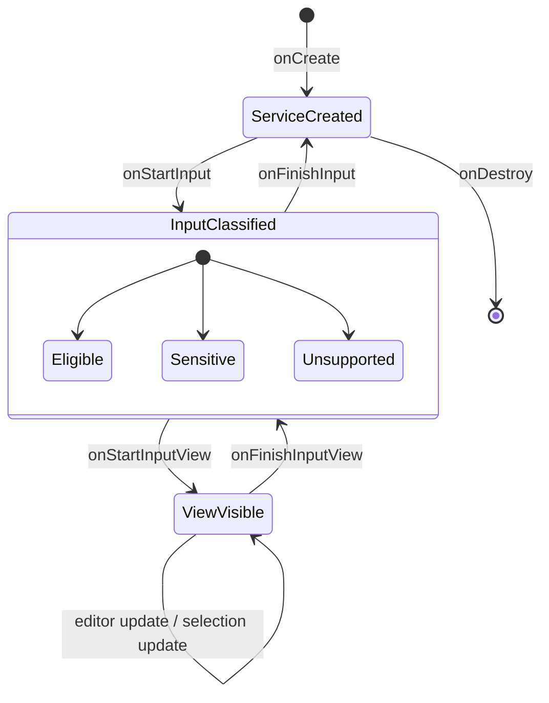
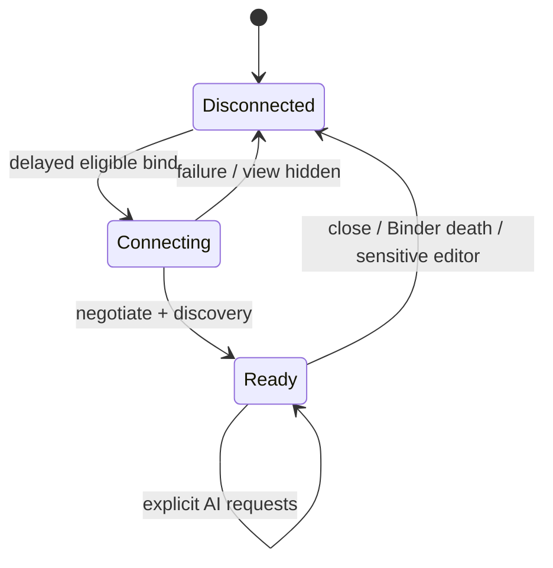
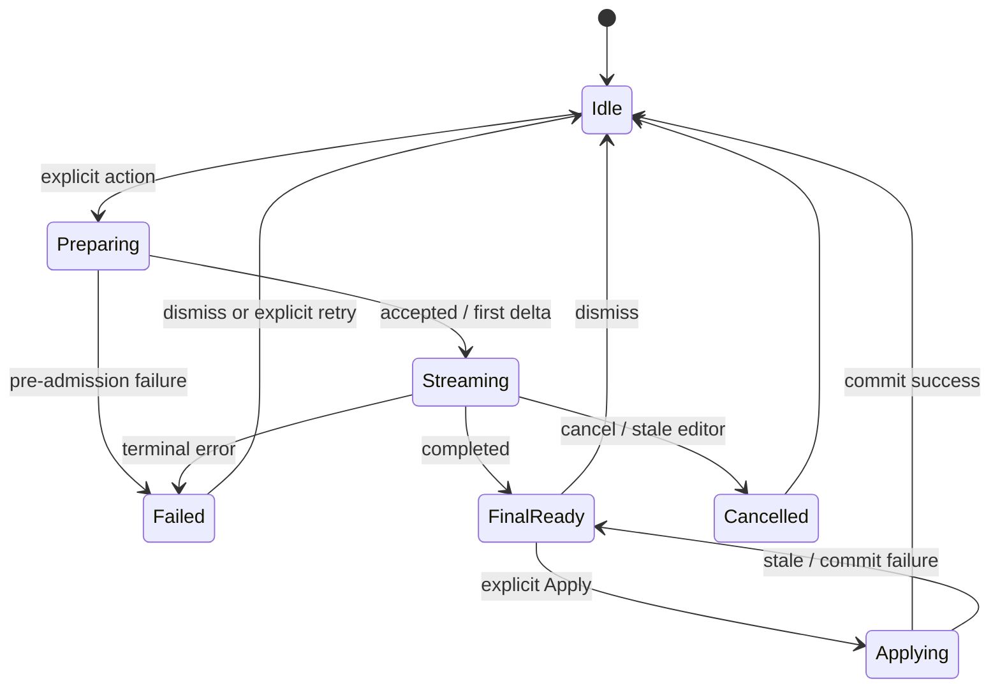

# Keyboard Architecture Specification v1.0

**Status:** Stable — approved 2026-07-15

**Date:** 2026-07-15

**Scope:** Touvay Keyboard integration with the Stable Touvay Engine Platform

This document is the approved implementation contract for the first product client of
Touvay Engine and is incorporated by reference into the frozen Platform Architecture.
It introduces no Runtime, Model Manager, Execution Engine, Capability Framework, SDK,
or Binder contract changes. Any future semantic change requires an accepted ADR before
implementation.

## 1. Goals

- Preserve typing availability and latency regardless of AI state or failure.
- Keep inference, native code, model memory, and model crashes outside the IME process.
- Invoke AI only through explicit user actions and the typed capability SDK.
- Make every editor mutation deliberate, stale-safe, reversible by the host editor, and
  independent of streaming progress.
- Keep user content request-scoped, memory-only, minimized, and content-free in logs.
- Provide accessible streaming and error UX without exposing model, prompt, Runtime,
  Model Manager, or routing internals.
- Remain fully useful as a keyboard when the engine, model, or capability is unavailable.

## 2. Non-goals

- No product work beyond a separately authorized keyboard implementation phase.
- No per-keystroke LLM inference, ambient proofreading, or background generation.
- No Grammar, Translation, retrieval, memory, networking, or cloud fallback.
- No new public SDK, Binder, Runtime SPI, Model Manager, Scheduler, or Capability SPI
  surface.
- No persistence of editor text, selection text, prompts, model output, transcripts, or
  Runtime sessions.
- No direct model selection, prompt construction, model installation, or Runtime access
  from the keyboard.

## 3. Governing platform contracts

This specification instantiates, and does not replace:

- ADR-001: inference runs in the isolated engine process;
- ADR-004: the keyboard calls typed capabilities, never a prompt tunnel;
- ADR-009: capability discovery, not client version checks;
- ADR-010: interactive priority, cooperative cancellation, and coalescing;
- ADR-012 and ADR-019: no durable engine user state; Runtime sessions are attempt-scoped;
- ADR-013: local-only, content-free diagnostics;
- ADR-017: immutable request plans, terminal arbitration, and no rerouting on retry;
- ADR-018: bounded credit-based streaming;
- ADR-022 and ADR-023: explicit context, internal provenance, deterministic merge, and
  exact tokenizer budgeting.

No new platform ADR is required for this proposal because it adds a client architecture
without changing a Stable platform decision. A departure from any invariant above, or a
semantic change to this document after approval, requires a new ADR.

## 4. Hard invariants

1. The keystroke-to-`InputConnection` path performs no SDK call, Binder call, file I/O,
   model work, capability discovery, engine connection, or AI state synchronization.
2. Failure, slowness, OOM, or death of `:touvay` never prevents ordinary typing.
3. Password, visible-password, web-password, number-password, and
   `TYPE_TEXT_FLAG_NO_SUGGESTIONS` editors never expose an AI action.
   `IME_FLAG_NO_PERSONALIZED_LEARNING` and keyboard incognito mode also disable AI.
4. Only content explicitly selected or entered into an AI action is sent to the engine.
   Clipboard, surrounding text, application content, and screen content are never read
   ambiently.
5. Streaming output is preview-only. It is never committed to the target editor.
6. Final output is committed only after explicit user acceptance and a successful stale
   editor/selection check.
7. Exactly one foreground AI action may own the keyboard AI surface at a time.
8. Hiding the input view, changing editor identity, entering a sensitive editor, or
   destroying the IME cancels active work and releases the SDK connection.
9. The keyboard remains operational with AI permanently disabled or absent.

## 5. Process and ownership model

| Resource | Owner | Lifetime | Forbidden ownership |
|---|---|---|---|
| `InputMethodService` and `InputConnection` | Keyboard process | Android IME lifecycle | Engine and SDK |
| Keyboard typing state and local candidates | Keyboard typing subsystem | Active editor/view | AI controller and engine |
| `KeyboardEditorSession` | Keyboard AI controller | One `onStartInput` epoch | Engine |
| Explicit selection snapshot | One `AiActionSession` | Until cancel/terminal/apply | Logs, disk, process singleton |
| `TouvayClient` | Keyboard AI connection owner | Eligible visible-input interval | Activity/static singleton |
| Rewrite request coroutine | One `AiActionSession` | One user action | IME service global scope |
| Request record, plan, attempt, credits | Execution Engine | One submitted request | Keyboard |
| Runtime session | Execution attempt | One attempt | Keyboard and Model Manager |
| Model lease and instance | Model Manager/attempt | Engine-defined lease | Keyboard |

`KeyboardEditorSession` is a client-side lifecycle token, not an engine or Runtime
session. It contains a monotonically increasing in-process `editorEpoch`, a minimized
eligibility classification, and current AI UI state. It does not contain a transcript
or survive process death.

`AiActionSession` owns the only strong references to selected text and streamed/final
output. Those references are dropped on terminal completion, cancellation, editor
change, or view teardown. JVM strings cannot be reliably zeroized, so minimization and
short ownership are the enforceable controls.

## 6. IME lifecycle

### 6.1 State model



Every `onStartInput` increments `editorEpoch`, cancels the previous action, clears all
previous editor content, and classifies the new `EditorInfo`. Reuse of an
`InputConnection` object or package name never implies session continuity.

### 6.2 Callback responsibilities

| Callback | Required behavior | Must not do |
|---|---|---|
| `onCreate` | Create lightweight scopes, state holders, and local policy observers | Bind engine, perform discovery, touch models |
| `onStartInput` | Increment epoch, cancel old action, classify editor, clear content | Read selection or surrounding text preemptively |
| `onStartInputView` | Render keyboard immediately; after first frame, permit eligible delayed binding | Wait for engine or model |
| `onUpdateSelection` | Update non-content selection coordinates; invalidate stale action when required | Submit AI work |
| `onFinishInputView` | Cancel active action, hide AI surface, close client after bounded grace | Block teardown waiting for engine |
| `onFinishInput` | Clear editor session and all content references immediately | Persist state for reconstruction |
| `onDestroy` | Cancel service scope, close SDK client, release observers | Synchronously wait for Binder/native cleanup |

Configuration changes and process recreation follow the same teardown/reclassification
path. No AI state is restored from a bundle or persistent store.

## 7. Engine lifecycle and binding strategy

### 7.1 Connection state



The keyboard uses the existing SDK connection only. It never binds to
`TouvayEngineService` directly.

Binding policy:

1. Ordinary keyboard rendering and typing complete first.
2. If the visible editor is eligible and device policy permits, a low-priority task may
   call `Touvay.connect` after the first input-view frame.
3. Connection and capability discovery run outside the main/typing path. The AI affordance
   remains unavailable or shows a non-blocking preparation state until discovery completes.
4. Binding does not load a model. Model acquisition remains request-driven inside the
   engine.
5. `TouvayClient` is scoped to the eligible visible-input interval. A short bounded
   disconnect grace may absorb rapid view recreation, but it retains no editor content
   and never keeps a model lease.
6. Battery saver, thermal pressure, a sensitive editor, or incognito mode disables
   speculative binding. An explicit action may connect only when policy permits.
7. Binder death fails the current action and returns the controller to `Disconnected`.
   Reconnection may prepare a later user action but never auto-resubmits generation.

The keyboard must not use `startService`, a foreground service, wake locks, polling, or
repeated bind loops. Reconnect backoff is bounded and stops when the input view is no
longer eligible.

## 8. Session ownership

There are three deliberately different lifetimes:

1. **Editor session:** keyboard-owned `editorEpoch`, from `onStartInput` to
   `onFinishInput`.
2. **AI action session:** keyboard-owned explicit request and preview state, nested
   within one editor session.
3. **Runtime session:** engine-owned request-attempt object under ADR-019.

An AI action records the epoch, selection range, selected text, requested capability
options, and a client-local action ID. It may not hold `EditorInfo`, `InputConnection`,
`Context`, view objects, or Activity references beyond the calls that need them.

The engine request ID is never used as an editor identity. Coalescing identity is scoped
to the authenticated keyboard client and current editor epoch; it contains no user text,
package name, or stable cross-application identifier.

## 9. AI action flow

Rewrite is the only authorized AI capability. The architecture remains capability-driven
so later approved capabilities can reuse the flow without changing the engine.

```mermaid
sequenceDiagram
    actor User
    participant IME as Keyboard UI
    participant KAC as AI Controller
    participant SDK as Touvay SDK
    participant ENG as Engine Process
    participant APP as Target InputConnection

    User->>IME: Select text and choose Rewrite
    IME->>KAC: Start action(editorEpoch, options)
    KAC->>KAC: Recheck editor eligibility
    KAC->>APP: Read explicit selected text
    APP-->>KAC: Selection snapshot
    KAC->>SDK: Discover text.rewrite availability
    SDK-->>KAC: Ready
    KAC->>SDK: RewriteRequest(snapshot, options)
    SDK->>ENG: Credit-controlled Binder request
    ENG-->>SDK: Accepted
    loop Bounded streaming
        ENG-->>SDK: Delta
        SDK-->>KAC: RewriteEvent.Delta
        KAC-->>IME: Preview-only update
    end
    ENG-->>SDK: Final structured result
    SDK-->>KAC: RewriteEvent.Completed
    KAC-->>IME: Final preview + Apply action
    User->>IME: Apply
    IME->>KAC: Confirm
    KAC->>APP: Re-read and validate epoch/selection
    alt Snapshot still matches
        KAC->>APP: beginBatchEdit + commitText + endBatchEdit
        KAC-->>IME: Applied
    else Editor is stale
        KAC-->>IME: Do not mutate; show stale-result state
    end
```

### 9.1 Admission and validation

- The action button is absent for sensitive/unsupported editors.
- Empty, oversized, or invalid selections fail locally without connecting to the engine.
- Capability availability comes from SDK discovery, never a hardcoded engine/model check.
- Locale and options are typed request fields. Raw prompts are forbidden.
- The selected text is the only mandatory user-content input for Rewrite v1.

### 9.2 Safe application

Before applying a final result, the controller verifies:

- the IME service and input view are still active;
- the same `editorEpoch` is current;
- editor eligibility remains non-sensitive;
- the current selection range and selected text still match the action snapshot; and
- the result belongs to the current non-cancelled action.

Failure of any check prevents mutation. The keyboard never guesses a replacement range.
Commit occurs as one `InputConnection` batch operation so the target editor owns undo.
If `commitText` fails, the result remains a preview until dismissed; it is not retried
silently.

## 10. Suggestion flow

Typing suggestions and AI results are separate lanes:

| Lane | Trigger | Execution | UI | Editor mutation |
|---|---|---|---|---|
| Local typing suggestions | Keystrokes | Existing keyboard-local subsystem | Candidate strip | Existing keyboard behavior |
| AI Rewrite result | Explicit Rewrite action | Touvay SDK and engine | Dedicated AI preview surface | Final-only, explicit Apply |

The AI controller does not subscribe to keystrokes, composing-text changes, or local
candidate updates. It does not rank, suppress, delay, or replace local candidates.
There is no automatic AI suggestion generation, debounce loop, or idle-time inference.

An AI preview may temporarily occupy a dedicated panel but must not commandeer the
candidate strip in a way that prevents normal typing or obscures the keyboard dismissal
controls. Typing while a preview is open invalidates or cancels the action according to
the stale rules; local suggestions continue independently.

## 11. Streaming UX

AI UI state is a single-owner state machine:



- Deltas are rendered only in the AI preview surface.
- SDK credit flow remains the authoritative backpressure mechanism. The keyboard does
  not introduce an unbounded channel or callback queue.
- UI updates may coalesce adjacent deltas to at most one visual update per frame, while
  preserving byte/order correctness and the full bounded final result.
- The preview indicates that output is provisional until the structured terminal result.
- The first usable preview must not steal focus from the editor or dismiss the keyboard.
- Partial output is discarded on cancellation or error and cannot be applied.
- TalkBack does not announce each token. It announces state changes and the final result
  once, with an explicit control for reading the preview.

## 12. Cancellation and stale-result handling

Cancellation is idempotent and propagates through coroutine cancellation to SDK Binder
cancellation, Scheduler, `CancelSignal`, and Runtime decode.

| Trigger | Keyboard action | User-visible outcome |
|---|---|---|
| User taps Cancel | Cancel action scope immediately | Preview closes or shows Cancelled briefly |
| New Rewrite action | Cancel/coalesce old action first | Only newest action owns UI |
| `onStartInput` / editor epoch changes | Cancel and clear content | No output crosses editors |
| `onFinishInputView` / `onFinishInput` | Cancel and detach UI | Typing lifecycle continues |
| Selection or selected text changes | Mark stale; cancel active generation | Result cannot be applied |
| Editor becomes sensitive/incognito | Cancel, close client, clear content | AI affordance disappears |
| Binder death | Fail action as disconnected | No automatic resubmission |
| Thermal critical / memory emergency | Cancel active action | Typing remains available |
| IME destruction | Cancel service scope and close client | No blocking teardown |

Cancellation and success may race; only the SDK/engine terminal winner is observed.
The keyboard must still perform its own epoch/snapshot validation before mutation because
a valid engine success can become stale relative to the editor.

Retry is always an explicit user action. The keyboard does not retry generative work
automatically, including after engine death, timeout, or a result that has started
streaming.

## 13. Threading and typing-latency isolation

| Work | Execution context |
|---|---|
| Keystrokes, composing text, `InputConnection` mutation, view state | Existing IME/UI thread, with no AI waits |
| SDK connect/discovery and request collection | Structured keyboard AI scope off the typing path |
| Snapshot validation reads | Serialized through the IME-owned editor boundary |
| Prompt, scheduling, model, and inference work | Isolated `:touvay` engine process |

Implementation must provide a one-way dependency from AI UI/controller code to the SDK;
the typing subsystem must not depend on AI controller state. AI state may request a UI
render, but never hold a lock used by key dispatch, composing, candidate generation, or
`InputConnection` operations.

Performance release gates include:

- zero Binder/SDK calls in keystroke traces;
- no engine bind or capability discovery before the first keyboard frame;
- no measurable regression beyond the keyboard's approved p95/p99 key-dispatch budget;
- cancellation and view teardown that do not wait synchronously for engine cleanup; and
- memory tests proving engine death/unavailability does not grow the IME process over
  repeated action cycles.

## 14. Thermal policy

The engine Scheduler is authoritative for admission, thread count, decode quanta, and
thermal enforcement. The keyboard applies a conservative presentation/binding policy so
AI never competes with typing for device stability.

| Thermal state | Keyboard policy | Engine expectation |
|---|---|---|
| None / Light | Delayed eligible bind; explicit actions available | Normal interactive policy |
| Moderate | No speculative bind retention; explicit short action allowed with non-blocking warm-device notice | Shed background work and reduce compute as configured |
| Severe | Do not start a new action unless the engine explicitly reports it admissible; keep typing UI primary | Refuse background and enforce interactive limits |
| Critical or above | Cancel active AI, close connection after cancellation, disable affordance | Release request resources promptly |

The keyboard must not duplicate model- or Runtime-specific thermal thresholds. If a
future richer status is needed at the SDK boundary, it is an additive platform change
and requires architecture review under the freeze rule.

## 15. Battery policy

- The keyboard never starts background inference, scheduled AI work, or periodic polling.
- Battery Saver or low-battery mode disables speculative connection and warm grace.
- An explicit Rewrite may run under Battery Saver only if current engine policy admits
  it; the UI communicates reduced availability without blocking typing.
- At critically low battery, new AI actions are disabled and active work may be cancelled.
- The IME owns no wake lock for AI. It does not keep the engine alive after the visible
  eligible-input interval.
- Model acquisition/download is absent from this product milestone. The keyboard never
  enables network connectivity to satisfy a capability request.

## 16. Accessibility

- AI actions, tone/length choices, Cancel, Apply, Dismiss, and Retry have stable semantic
  labels, roles, and state descriptions.
- Focus order remains editor controls → local candidates → AI action → AI preview
  controls; streaming never steals accessibility focus.
- Touch targets meet Android accessibility sizing; layouts support font scaling,
  high-contrast themes, RTL, switch access, and external keyboards.
- Loading/streaming/final/error state changes use restrained live-region announcements.
  Token-by-token announcements are forbidden.
- The final result is readable as a coherent region before Apply. Apply announces success;
  stale or failed commit announces that the editor was not changed.
- Motion is nonessential and respects reduced-animation settings.
- Accessibility services do not gain additional engine or context authority through the
  keyboard integration.

## 17. Offline guarantees

The keyboard integration provides these auditable guarantees:

1. No inference-path module or keyboard AI component declares or uses a networking
   client.
2. Rewrite is available only when a compatible signed pack is already installed and
   verified locally.
3. Missing packs produce capability-unavailable UX; they never trigger a silent download.
4. There is no cloud fallback, remote prompt, telemetry, crash upload, analytics event,
   or remote configuration dependency.
5. Airplane mode does not change the behavior of an already installed Rewrite path.
6. A future downloader remains a separately approved, consent-gated component and may
   never receive editor content.

Instrumentation must run with network detection enabled and prove that Rewrite, cancel,
error, and engine-recovery scenarios open no socket.

## 18. Privacy boundaries

### 18.1 Editor boundary

The target application owns its `InputConnection`. The keyboard may read selected text
only after an explicit AI action. It does not read full surrounding text, extracted
editor text, clipboard, screen content, contacts, files, or application state for
Rewrite v1.

Eligibility is fail-closed. Unknown or malformed `EditorInfo` classifications disable
AI. Sensitive-field blocking exists in both the keyboard integration and the SDK/client
policy boundary so a UI bug cannot become content disclosure.

### 18.2 SDK and engine boundary

Only typed capability payloads cross Binder. The SDK exposes no prompt, model, pack,
runtime, session, or route. Selection content has internal `USER_SELECTION` provenance;
typed options are `CLIENT` metadata. Provenance topology remains engine-internal.

### 18.3 Storage and diagnostics boundary

- Editor input, selected text, output, prompts, and transcripts are never persisted.
- Logs, metrics, exceptions, traces, screenshots, accessibility labels, and incident IDs
  contain no user content.
- Diagnostic timing and capability/runtime category may be shown locally, but model
  identity and content are excluded from product UI.
- Android backup excludes engine/model state as already required by the platform; the
  keyboard adds no AI user-state store.
- Test fixtures use synthetic content and never capture real application/editor data.

## 19. Failure handling

| Failure | Required behavior |
|---|---|
| Engine unavailable/disconnected | Disable or fail AI action; typing unaffected; later explicit action may reconnect |
| Capability unavailable | Explain that offline Rewrite is not ready; do not expose model details or download silently |
| Invalid/oversized selection | Local bounded validation error; no engine submission |
| Engine busy/thermal refusal | Non-blocking retry-later UX; no automatic retry |
| Cancellation/deadline | Clear provisional preview; retain no content |
| Structured-output failure | Do not apply partial/raw output |
| Binder/native process death | Fail current action, clear preview, release client; IME stays alive |
| Stale editor/result | Preserve preview only until dismissal; never mutate target editor |
| `InputConnection` commit failure | Report not applied; do not repeat commit automatically |

All messages are content-free. Incident identifiers may be displayed for local manual
support export under ADR-013.

## 20. Testing and release gates

Keyboard implementation is incomplete without:

- lifecycle tests for every callback transition, rapid editor switching, view recreation,
  process recreation, and teardown during each AI state;
- sensitive-editor and incognito tests proving no bind, selection read, or request;
- typing latency macrobenchmarks with engine absent, connecting, loading, streaming,
  cancelling, crashed, and memory-pressured;
- cross-process tests for signed Rewrite, bounded streaming, cancellation, Binder death,
  stale selection, commit failure, and explicit retry;
- privacy tests that inspect logs, exceptions, saved state, backup data, and traces for
  synthetic sentinel content;
- network-detection tests in all AI flows;
- thermal, Battery Saver, low-memory, and repeated bind/unbind tests;
- accessibility tests with TalkBack, switch access, large font, RTL, and reduced motion;
- dependency rules proving the keyboard depends on the typed SDK only and has no Runtime,
  Model Manager, Execution Engine, capability implementation, or model-pack dependency;
- existing full build, API compatibility, dependency rules, Runtime TCK, Capability TCK,
  Rewrite TCK, and platform integration tests remaining green.

Physical-device validation must include the representative 4 GB arm64 gate before a
model-backed keyboard capability can ship.

## 21. Architecture review checklist

Approval should confirm:

- delayed visible-session binding is the accepted latency/battery balance;
- AI remains explicit-action-only and separate from local suggestions;
- partial streaming output is preview-only and final output requires explicit Apply;
- epoch plus selection-content revalidation is sufficient for stale-result prevention;
- critical thermal/memory state cancels AI while leaving typing untouched;
- sensitive-editor and incognito behavior is fail-closed;
- no platform API or module-boundary change is required; and
- future semantic changes require an ADR.

This document was approved and marked Stable on 2026-07-15. Keyboard Alpha Phase 1 is
authorized for the IME shell, lifecycle, deferred engine connection, Rewrite preview and
Apply flow, diagnostics, cancellation, progress, and error handling in the separate
Touvay Keyboard repository. The Engine repository owns only the SDK, embedded engine
host, and this integration contract; it contains no keyboard implementation. Approval
does not authorize additional keyboard product work, Grammar, Translation, networking,
retrieval, memory, or changes to Stable platform modules.
