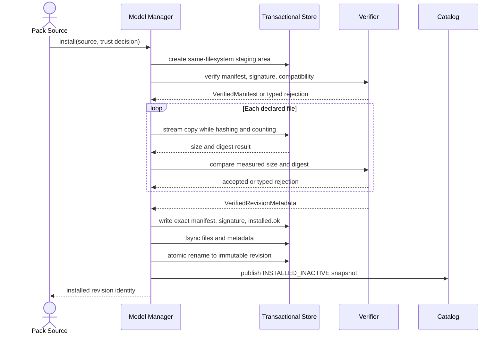
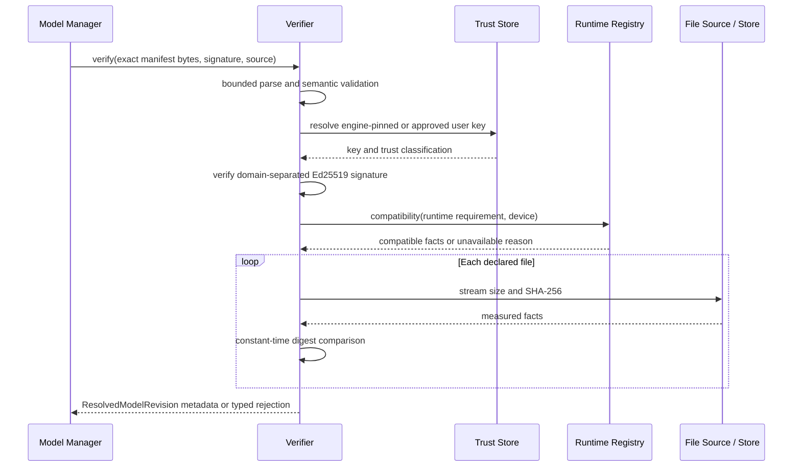
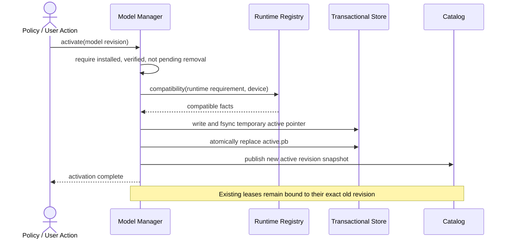
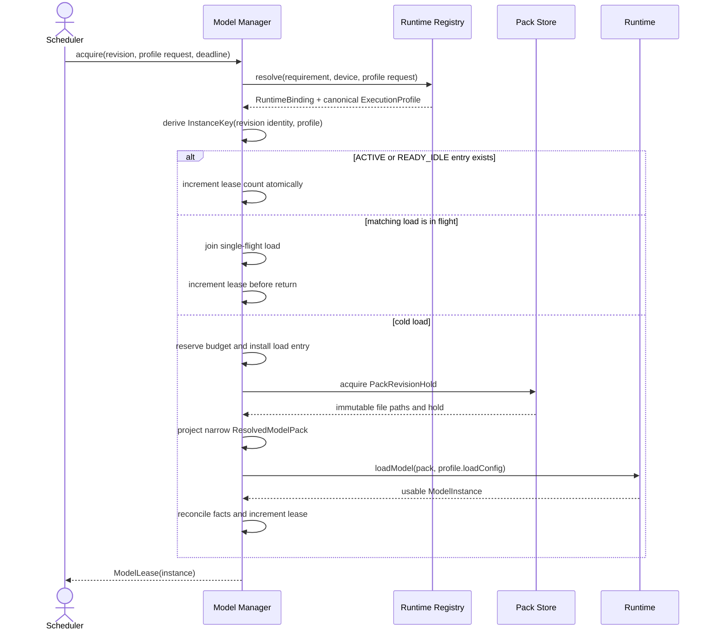
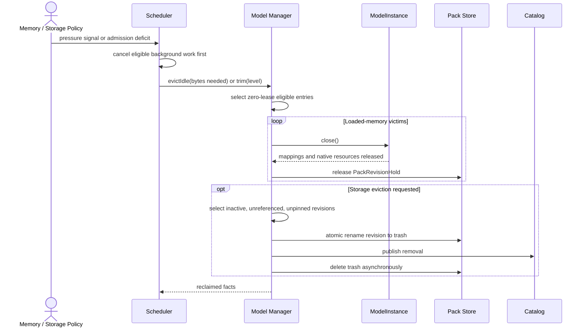

# Model Manager Architecture v1.0

**Status:** Frozen architecture — Slices 1–3 approved; Slice 4 authorized, not implemented
**Checkpoint baseline:** `runtime-v1.0-foundation` (`7a68daa`)
**Decisions:** [ADR-015](../adr/ADR-015-model-manager-resolution-and-instance-identity.md)
and [ADR-016](../adr/ADR-016-model-pack-manifest-and-signature-envelope.md)
**Scope:** Normative implementation contract for Task 3. This document authorizes no
production Model Manager code or engine wiring. Any implementation deviation that
changes ownership, trust, durable format, identity, or dependency direction requires
architecture review and an ADR amendment.

## 1. Context and architectural alignment

The Model Manager implements the pack and loaded-instance ownership described by
`docs/ARCHITECTURE.md` §13–§14 and ADR-005/006/011/012/015/016. It sits between
execution planning and Runtime v1.0:

```text
Router / Scheduler
       │ acquire(model revision, profile request), release(lease), pressure signal
       ▼
Model Manager ── catalog + install + versions + budgets + refcounts
       │ resolve(runtime requirement)
       ▼
Runtime Registry ── compile-time runtime bindings + probe cache
       │ ResolvedModelPack projection + LoadConfig
       ▼
Runtime SPI ── InferenceRuntime → ModelInstance → InferenceSession
```

The approved architecture remains unchanged:

- apps request capabilities, never models;
- model packs are signed data, never runtime-loaded code;
- the downloader is the only future networked component;
- the Runtime Registry owns compile-time runtime registrations and resolution;
- runtime adapters own native handles, while the Model Manager owns pack-file lifetime
  and loaded-instance lifetime;
- the scheduler owns priority/admission policy; the Model Manager supplies facts and
  performs requested lifecycle operations;
- the engine stores no durable user content. Pack/catalog operational state is durable
  product state, not user conversation state.

### 1.1 Frozen refinement decisions

1. The Model Manager depends on a `RuntimeRegistry` resolution port. It never owns or
   enumerates concrete runtime registrations.
2. `ResolvedModelPack` remains the narrow Runtime v1 SPI load DTO. A richer internal
   `ResolvedModelRevision` owns manager/catalog concerns and is projected into
   `ResolvedModelPack` only while creating a runtime load input.
3. Runtime v1 has no `PREPARING` loaded-instance state. `InferenceRuntime.loadModel`
   returns a usable instance by contract; optional future preparation requires a typed
   SPI feature and conformance tests before the lifecycle can gain that transition.
4. Loaded instances are keyed by an exact `ModelRevisionIdentity` plus the semantic
   `ExecutionProfile` returned by runtime resolution, not by an open-ended tuple of
   today's fields.
5. Model packs use protobuf manifest bytes plus a detached, domain-separated Ed25519
   signature. This durable security format is frozen by ADR-016 before implementation.

### 1.2 Implementation gates

Slice 1 is explicitly authorized and complete. Before runtime/lifecycle wiring or later
Task 3 slices begin:

1. run Runtime v1.0 on a representative 4 GB arm64 device and calibrate T1 budgets;
2. make release-CI model fixture provisioning mandatory rather than silently skipped;
3. fix the three engine-core stabilization items recorded in
   `docs/runtime/runtime-v1.0-release.md` (`RequestProcessor` publication race,
   callback-contract mismatch, and untrusted exception-message propagation);
4. retain the pinned, audited Ed25519 verifier decision recorded in §9.1, or review any
   replacement as a security/dependency change;
5. obtain explicit authorization for the next slice. Slice 1 approval does not authorize
   storage, catalog, installation, lifecycle, or runtime integration.

## 2. Responsibilities

The Model Manager is responsible for:

- discovering installed pack versions and rebuilding a trusted catalog;
- installing staged, offline pack sources transactionally;
- validating manifest structure, compatibility, signatures, paths, sizes, and hashes;
- maintaining immutable, side-by-side pack versions and an atomic active-version pointer;
- resolving a verified version to `ResolvedModelPack` paths for Runtime SPI;
- resolving a compatible runtime binding through the Runtime Registry;
- single-flight model loading and loaded-instance caching;
- reference-counted `ModelInstance` leases;
- guaranteeing mmap-backed files remain immutable and present until instance close;
- enforcing injected memory/storage budgets and evicting eligible idle resources;
- supporting multiple installed packs and multiple loaded instances where the device
  budget permits;
- coordinating upgrades, rollback, uninstall, and crash recovery;
- exposing immutable catalog/lifecycle snapshots to the router, scheduler, diagnostics,
  and tests;
- returning typed, content-free failures.

It is not responsible for inference sessions, prompt construction, request scheduling,
capability quality evaluation, network acquisition, or user-facing consent UI.

## 3. Goals

1. **Correct ownership.** No pack file is removed or mutated while any runtime instance
   can mmap/read it; every loaded instance closes exactly once.
2. **Crash-safe installation.** Power loss or process death at any instruction leaves
   either the previous installed state or a fully verified new version—never a partially
   active pack.
3. **Security before availability.** Unverified content never enters a runtime.
4. **Rebuildable state.** Durable markers and immutable pack directories are the source
   of truth; catalog indexes are disposable caches.
5. **Budget-aware multi-model support.** T1 remains safe with one small resident model;
   higher tiers may retain multiple instances without changing APIs.
6. **Additive evolution.** Manifest schemas and catalog records evolve by addition;
   unknown optional fields are tolerated and unknown required features reject cleanly.
7. **Deterministic testing.** Filesystem, clock, runtime registry, budget, and failure
   injection are ports so lifecycle logic runs as pure JVM tests.
8. **Offline operation.** No network dependency or permission is introduced.

## 4. Non-goals

- model download/CDN/PAD/OEM acquisition;
- user-import picker, warnings, or consent UX;
- capability routing or plan ranking;
- request priority, coalescing, preemption, or thermal policy;
- inference-session pooling, KV prefix caching, or pause/resume;
- model conversion, quantization, training, or LoRA application;
- dynamic runtime/plugin code loading;
- cloud fallback or telemetry;
- implementing Task 3 production code during this design review.

The first implementation should accept an already staged local `PackSource`. A future
networked downloader supplies that source through the same install port from a separate
module.

## 5. Module and dependency boundaries

Task 3 implementation creates `engine/engine-models` only after explicit authorization.

```text
engine-models ──► runtime-api
engine-service ─► engine-core, engine-models, runtime adapters, contract
engine-core    ─► runtime-api (existing)
```

`engine-models` must not depend on Android UI, Binder, SDK, a concrete runtime adapter,
or any network library. It may use Kotlin coroutines, `java.nio`, protobuf-lite, and one
reviewed Ed25519 verifier through narrow injectable ports. Android lifecycle/trim signals
enter through `engine-service`; concrete runtimes are registered at the composition root
behind a Runtime Registry.

The future scheduler/router consumes a narrow engine-core port. The concrete manager
must not depend back on engine-core merely to satisfy that port; `engine-service` may
adapt/wire the two. This prevents a cycle and keeps engine-core pure.

### 5.1 Runtime Registry

The Model Manager depends on a resolution port, never a registration collection. The
following signatures are conceptual architecture, not production API:

```kotlin
interface RuntimeRegistry {
    fun compatibility(
        requirement: RuntimeRequirement,
        device: DeviceProfile,
    ): RuntimeCompatibility

    fun resolve(
        requirement: RuntimeRequirement,
        device: DeviceProfile,
        request: ExecutionProfileRequest,
    ): RuntimeResolution
}
```

`compatibility` answers whether at least one compiled-in binding can satisfy a manifest
without selecting load policy. Verification, activation, recovery, and catalog rebuild
use it. `resolve` applies an acquire-time profile request and returns the exact binding
and canonical profile used for instance identity.

The registry owns:

- immutable compile-time registrations supplied by `engine-service`;
- adapter-version and supported-feature metadata;
- runtime-id uniqueness validation;
- device probing and availability caching for the current device snapshot;
- resolution of one compatible `RuntimeBinding` or a typed unavailable result.

A successful `RuntimeResolution` contains a `RuntimeBinding` and canonical
`ExecutionProfile`. The binding contains the resolved `InferenceRuntime`, runtime id,
adapter version, feature set, and a stable binding identity. The profile combines that
binding identity with the normalized load-affecting choices selected during resolution.
This avoids a circular input: callers submit an `ExecutionProfileRequest`; only the
registry can return the final profile after choosing a binding/accelerator. Adapter
version remains composition metadata, not a new Runtime SPI method. The registry does
not load models, own instances, rank plans, or dynamically discover code. The Model
Manager does not retain a second registration map or call arbitrary adapters while
validating a manifest.

### 5.2 Resolved model boundary

Runtime v1's `ResolvedModelPack` remains unchanged. It is intentionally a narrow SPI DTO:
pack id, version, and logical file name to absolute path. Expanding it with signatures,
trust, capability metadata, activation state, storage references, or execution policy
would leak Model Manager concerns into every runtime adapter and create an unnecessary
public-API change.

The manager instead owns an immutable internal `ResolvedModelRevision` containing:

- `ModelRevisionIdentity` and manifest digest;
- parsed manifest metadata and trust classification;
- runtime requirement and declared resource constraints;
- capability descriptors;
- immutable file descriptors (logical path, role, size, digest, absolute path);
- installed/active health facts needed by catalog and policy.

At load time the manager acquires a `PackRevisionHold`, resolves a `RuntimeBinding`, and
projects the exact revision into `ResolvedModelPack`. The loaded entry owns the hold until
`ModelInstance.close()` returns. The projection is never cached independently from its
hold and never becomes a richer Runtime SPI abstraction.

This two-level design is the long-term recommendation: rich orchestration metadata stays
internal and evolvable, while the already-approved adapter boundary remains small and
stable. A future runtime may receive new load facts only through an additive, runtime-
relevant SPI type—not by exposing the complete manifest.

## 6. Metadata format

### 6.1 Recommendation

Use an engine-models-owned protobuf-lite `manifest.pb` plus a detached binary
`manifest.sig`, as frozen by ADR-016.

This deliberately refines the illustrative JSONC manifest and inline signature in
`docs/ARCHITECTURE.md` §13.1. It does not change the approved signed, data-only pack
architecture. Retaining canonical JSON with an inline signature was rejected because
canonicalization would become security-critical and the first implementation slice must
not create a durable format before that decision is frozen.

Reasons:

- signing raw manifest bytes avoids ambiguous JSON canonicalization;
- protobuf provides additive schema evolution and bounded parsing;
- verification never reserializes before signature checking, so unknown fields do not
  alter signed bytes;
- the format is durable pack metadata, not an AIDL/capability wire schema, so it belongs
  to `engine-models`, not `touvay-contract` under ADR-014.

`manifest.sig` contains a fixed magic/version, algorithm id (`Ed25519`), key id, and
64-byte signature. ADR-016 defines the exact byte layout. The manifest repeats
`signing_key_id`; the two values must match. Key ids use lowercase ASCII
`[a-z0-9][a-z0-9._-]{0,63}`; user-approved keys use the lowercase hexadecimal SHA-256
fingerprint of the raw 32-byte Ed25519 public key.

Signature input is domain-separated:

```text
UTF8("TOUVAY_MODEL_PACK_V1\0") || exact manifest.pb bytes
```

### 6.2 Manifest fields

```text
schema_version: uint32
pack_id: string
pack_version: SemVer string
engine_min_version: SemVer string
engine_max_version: optional SemVer string
created_at_epoch_seconds: uint64
signing_key_id: string

runtime:
  id: string
  min_adapter_version: SemVer string
  required_features: repeated string

capabilities[]:
  id: string
  schema_version: uint32
  quality_score: uint32
  template_path: optional logical path
  config_path: optional logical path

resources:
  estimated_instance_ram_bytes: uint64
  max_context_length: uint32
  kv_bytes_per_token: optional uint64
  accelerators: repeated string

device_constraints:
  min_tier: enum
  supported_abis: repeated string
  min_android_api: optional uint32

files[]:
  logical_path: normalized relative UTF-8 path
  byte_size: uint64
  sha256: exactly 32 bytes
  role: enum (WEIGHTS, TOKENIZER, TEMPLATE, CONFIG, LICENSE, AUXILIARY)

license:
  spdx_id: string
  notice_path: optional logical path

required_manifest_features: repeated string
```

Limits are checked before allocation: manifest ≤1 MiB, signature envelope ≤4 KiB,
files ≤256, capabilities ≤128, path ≤240 UTF-8 bytes, and an 8 GiB hard ceiling on total
declared file bytes (a later install/storage policy may impose a lower limit). Unknown
required features reject; unknown optional fields are preserved/tolerated. Identifiers
are bounded lowercase ASCII, semantic versions use strict SemVer 2.0 precedence, and
logical paths must be relative NFC UTF-8 without traversal, Windows drive/device names,
backslashes, empty segments, or control characters.

## 7. Model lifecycle state machines

Installation and loaded-instance lifecycle are related but distinct.

### 7.1 Durable pack lifecycle

```text
ABSENT
  │ install(source)
  ▼
STAGING ──copy complete──► VERIFYING ──valid──► INSTALLED_INACTIVE
  │                           │                     │
  └─failure/process death─────┴──► REJECTED         │ activate
                                                     ▼
                                              INSTALLED_ACTIVE
                                                     │
                                    uninstall while referenced
                                                     ▼
                                              PENDING_REMOVAL
                                                     │ refs=0
                                                     ▼
                                                  ABSENT
```

`REJECTED` is an event/result, not a durable catalog state. Invalid staging content is
deleted; a bounded quarantine is optional only for developer builds because hostile
files should not consume production storage.

### 7.2 Loaded-instance lifecycle

```text
INSTALLED
   │ acquire (single-flight)
   ▼
LOADING ──success──► READY_IDLE ──lease++──► ACTIVE
   │                    ▲                       │
   └─failure──► LOAD_FAILED                 lease-- (last)
                         │                       ▼
                         └─────────────── READY_IDLE
                                                  │ idle/pressure/evict
                                                  ▼
                                             UNLOADING
                                                  │ close complete
                                                  ▼
                                              INSTALLED
```

`ModelInstance.close()` is the terminal transition for a loaded entry. New acquire calls
cannot join an entry after `UNLOADING` begins; they wait for unload and start a new load.

### 7.3 PREPARING decision

Runtime v1 deliberately does **not** add `PREPARING` between `READY_IDLE` and `ACTIVE`:

- SPI-LC-2 requires `loadModel` to return a usable instance, so mandatory backend setup
  and GPU upload belong inside `LOADING`;
- prefix-cache creation and runtime warmup consume execution resources and need scheduler
  admission, cancellation, ownership, and measurements rather than an ambiguous manager
  state;
- no Runtime v1 typed feature can perform such preparation, and architecture forbids
  speculative optional surfaces without an implementation and TCK coverage;
- a generic preparation hook would invite runtime-specific policy into the manager.

If a real backend later proves that reusable preparation must occur after load, it must
land as an additive typed Runtime SPI feature with its own ownership and TCK. At that
point `READY_IDLE → PREPARING → ACTIVE` may be added without changing today's direct
transition. Until then, warmup is either part of `loadModel` or an explicitly scheduled
request/session outside the Model Manager.

## 8. Installation flow

1. Receive a `PackSource` and an `InstallTrust` decision: `ENGINE_PINNED`, or
   `USER_APPROVED(publicKey, approvalProof)` supplied by a future consent UI. Every pack
   remains signed; unsigned imports are outside Task 3. No source path is adopted in
   place.
2. Allocate a random staging id beneath the Model Manager root on the same filesystem as
   final storage.
3. Read bounded `manifest.pb` and `manifest.sig`; validate envelope sizes and parse with
   protobuf recursion/size limits.
4. Validate identifiers, SemVer, engine/runtime compatibility, counts, declared sizes,
   required features, and every logical path.
5. Resolve the engine-pinned key, or validate the explicit user-approved key and its
   fingerprint, then validate the Ed25519 signature over the exact raw manifest bytes.
   User-approved imports are marked untrusted and never auto-selected; issuing the
   approval proof is outside Task 3.
6. Stream-copy each declared file into staging while computing SHA-256 and counting
   bytes. Reject missing, duplicate, extra (unless policy allows), oversized, short, or
   digest-mismatched files.
7. Reject absolute paths, `.`/`..`, empty segments, backslashes, NUL, device names,
   symlinks, hard links, and any resolved path escaping staging. Never trust archive
   metadata. Initial Task 3 should accept directory/stream sources, not archives.
8. Write the exact manifest/signature and an `installed.ok` record containing the
   manifest SHA-256; fsync file contents and staging metadata.
9. Atomically rename staging to the immutable final version directory. If atomic rename
   is unavailable, use a same-filesystem rename plus the `installed.ok` commit marker;
   directories without the marker are ignored and cleaned on recovery.
10. Rebuild/publish the catalog snapshot. Activation is a separate atomic operation.
11. Emit only local, content-free diagnostics. No telemetry or automatic export.

Installation is serialized per `(packId, version)`; different packs may verify in
parallel only when an injected I/O budget permits. Duplicate installation of identical
manifest bytes is idempotent. Same id/version with different manifest digest is rejected
as a supply-chain conflict, never overwritten.

## 9. Verification

### Verification layers

1. **Structural:** bounded parser, field types/counts, path normalization, duplicates.
2. **Compatibility:** engine range, Runtime Registry resolution, adapter version,
   required features, and ABI/API/tier constraints.
3. **Authenticity:** Ed25519 signature against an injected pinned-key trust store.
4. **Integrity:** exact file size and streaming SHA-256 for every declared file.
5. **Install marker:** manifest digest in `installed.ok` must match stored bytes.
6. **Load-time check:** immutable path, expected size, install marker, and a cheap
   metadata fingerprint. A full digest is repeated only when metadata changes, recovery
   detects inconsistency, or policy requires it.

Signature verification precedes expensive file copying for signed sources. File digests
remain mandatory because the signed manifest authenticates expected content, not the
current bytes on disk.

### 9.1 Signature validation

The engine trust store is build-pinned and versioned. Key removal prevents new trusted
installs; whether already installed packs remain usable is an explicit revocation policy
input. Emergency revocation data must be signed and cannot require telemetry.

Signature verification is behind a narrow `PackSignatureVerifier` port. Android's
[documented JCA provider](https://developer.android.com/reference/java/security/Signature)
only guarantees Ed25519 from API 33, while Touvay supports API 29. Slice 1 therefore pins
Google Tink Android 1.23.0, whose Android artifact supports API 24+. Touvay calls Tink's
raw-key `Ed25519Verify` constructor, which selects its pure-Java implementation on every
supported API rather than probing the platform JCA provider. The same bytecode and fixed
RFC 8032/golden vectors therefore govern API 29 through current Android. Tink is isolated
behind the port; custom Ed25519 code is forbidden and a pin bump requires dependency,
golden-vector, security, and APK-size review.

The resolved Tink JAR is 3,320,451 bytes before R8. It is the supported Android artifact
and requires no ProGuard configuration, but its final shrunk APK contribution must be
measured before engine-service wiring. Slice 1 deliberately does not create that wiring.

User-import trust is per explicit approval: the manager receives the publisher public
key plus an opaque, locally verifiable approval proof from the future consent boundary.
The key id is the SHA-256 fingerprint of the raw 32-byte Ed25519 public key and must match the
signature envelope and manifest. This proves that the approved key signed the exact
bytes without pretending that the publisher is engine-trusted. User-approved packs stay
excluded from automatic routing. An unsigned-import mode would violate the signed-pack
invariant and requires a separate architecture decision.

## 10. Storage layout

```text
<app-private-files>/touvay-models/v1/
├── root.version
├── staging/
│   └── <random-install-id>/...
├── packs/
│   └── <sha256(pack-id)>/
│       ├── identity.pb
│       ├── active.pb                 # version + manifest digest; atomic replace
│       └── versions/
│           └── <sha256(version+manifest-digest)>/
│               ├── manifest.pb
│               ├── manifest.sig
│               ├── installed.ok
│               └── files/<logical paths>
├── catalog-cache.pb                  # derived, disposable
└── trash/                            # rename-before-delete; recovery drains it
```

Pack ids and versions are never used directly as directory names. No symlinks represent
the active version. `active.pb` is written to a temporary sibling, fsynced, then renamed.

The source of truth is immutable version directories with valid commit markers plus
active pointers. `catalog-cache.pb` accelerates startup but may be deleted/rebuilt at any
time. Staging without a commit marker and trash are safe to remove during recovery.

Android backup must exclude the model root. Model files are app-private and never stored
in shared/external storage in production.

### 10.1 Slice 2 durable-format contract

Slice 2 implements the layout above with these exact local format rules:

- `root.version` is the ASCII record `TOUVAY_MODEL_STORE_V1\n`; a non-empty root without
  that record is never adopted;
- pack directories are lowercase `SHA-256(UTF-8(pack_id))`;
- revision directories are lowercase SHA-256 over
  `TOUVAY_MODEL_VERSION_DIR_V1 || 0x00 || UTF-8(version) || 0x00 || manifest_sha256`;
- `identity.pb`, `installed.ok`, and `active.pb` are bounded protobuf-lite records with
  schema version 1; install and active records repeat pack id, version, and the raw
  32-byte manifest digest;
- `installed.ok` is written and fsynced only after exact manifest, signature, payload
  files, and containing directory metadata are durable;
- directory commit may fall back from atomic move to a same-filesystem rename because
  the marker is the commit authority; active-pointer replacement has no non-atomic
  fallback;
- operations are serialized inside the single Model Manager writer. A second process or
  independently constructed writer is outside v1 and must not target the same root;
- recovery fully re-verifies signed metadata and payload digests, removes incomplete
  staging, drains trash, quarantines invalid revisions, and repairs an invalid pointer
  to the newest compatible verified SemVer (digest breaks an otherwise equal tie), or
  clears it when none remains.

The store performs full integrity verification before activation in Slice 2. A later
catalog slice may introduce the approved cheap metadata fingerprint without weakening
the mandatory full checks after recovery or observed metadata change. Slice 2 does not
publish a catalog, load a model, retain mmap references, or consult Runtime SPI.

## 11. Model catalog

The catalog is an immutable in-memory snapshot derived from verified installed records.
It contains no runtime instances and no user content.

For each version it exposes:

- pack id/version/manifest digest and trust level;
- active/inactive/pending-removal status;
- runtime requirements and compatibility result;
- capability descriptors and quality scores;
- declared resource/device constraints;
- install size and last verified time;
- load health (`NEVER_LOADED`, `HEALTHY`, bounded failure summary, `DISABLED_SESSION`).

Catalog updates are serialized and published atomically, e.g. via `StateFlow<CatalogSnapshot>`.
Readers never observe a partially installed pack. Startup scans commit markers, validates
active pointers, rebuilds the snapshot, then optionally rewrites the cache.

The capability router later joins this snapshot with device policy and runtime
availability. The catalog does not rank or select plans.

### 11.1 Slice 3 catalog and cache contract

Slice 3 implements an internal `ModelCatalogManager` with an atomically published,
immutable snapshot. Rebuild owns the storage recovery transaction and derives every
entry from a signed committed revision and the exact active pointer. It publishes only
after `CatalogConsistencyVerifier` proves unique identities, at most one durable active
revision per pack, compatibility/state agreement, balanced references, exact manifest
file descriptors, and paths contained under the immutable revision.

`catalog-cache.pb` is a bounded protobuf-lite cache of exact revision identity, a
versioned payload metadata fingerprint, and the last full-verification time. Rebuild
always revalidates signed manifest/signature/marker bytes and the exact file set. An
entry can avoid rehashing weights only when identity, sizes, paths, and nanosecond file
timestamps still match. Missing, malformed, duplicate, stale, or future-dated entries
force streaming digest verification. Cache replacement is atomic; interrupted temporary
files are discarded on restart. The cache is never required for correctness.

Version selection is intentionally pack-local and explicit: durable active revision,
exact revision identity, or highest compatible installed SemVer with manifest digest as
a deterministic tie-breaker. This is artifact selection, not capability ranking or
execution-plan routing.

## 12. mmap ownership and file immutability

The Model Manager owns pack files; the runtime owns mappings/native handles.

Rules:

1. A version directory becomes immutable before it enters the catalog.
2. `ResolvedModelPack` paths always point into one immutable committed version.
3. A loaded-entry hold counts as a storage reference independent of request leases.
4. Upgrade/activation never mutates an existing version; versions coexist.
5. Uninstall/rollback marks a referenced version pending removal. Physical deletion waits
   until the runtime instance closes and its storage hold reaches zero.
6. Manager calls `ModelInstance.close()` before releasing the storage hold.
7. Only after close completes may the directory be renamed to trash and deleted.

This directly satisfies SPI-MM-1/4 and prevents SIGBUS/corruption from deleting an mmap'd
GGUF.

## 13. Reference counting and concurrency

Slice 3 implements the prerequisite `PackRevisionLease`: an idempotent storage hold on
one exact immutable revision. It carries only resolved metadata/file descriptors and no
runtime object. Reference counts are process-local, published in catalog snapshots, and
block physical deletion. A referenced inactive revision becomes `PENDING_REMOVAL`; its
directory is deleted only after the last release. Process death releases every hold by
definition and leaves the committed revision safely installed; a process-local pending
removal request may need to be reissued because no durable removal tombstone exists in
the approved v1 storage layout.

The Runtime-backed `ModelLease` described below remains unimplemented until a later
explicit authorization.

`acquire(modelRevision, executionProfileRequest)` is suspending and returns an idempotent
`ModelLease : AutoCloseable`.

```text
InstanceKey = ModelRevisionIdentity + ExecutionProfile
```

### 13.1 Identity comparison

| Option | Strengths | Weaknesses |
|---|---|---|
| Option A — pack + version + digest + runtime + `LoadConfig` | Explicit and sufficient for Runtime v1 | Grows every time acceleration, delegate, quantization overlay, adapter binding, or load-affecting feature is added; encourages key construction outside one owner |
| Option B — stable model identity + execution profile | Separates artifact identity from execution semantics; extensible without redefining manager APIs; registry resolution and affinity use the same vocabulary | Unsafe if “stable model identity” means only logical pack id; requires canonical profile equality |

**Decision: B, refined to exact revision identity.** `ModelRevisionIdentity` is the
immutable `(packId, packVersion, manifestDigest)` revision—not merely the logical
`packId`. This prevents an active upgrade or rollback from reusing an instance backed by
different bytes. The manifest digest is over exact `manifest.pb` bytes.

`ExecutionProfileRequest` carries plan preferences and requested load settings.
`ExecutionProfile` is the canonical internal value returned by Runtime Registry
resolution and contains every fact that changes the loaded instance: binding identity,
normalized `LoadConfig`, selected accelerator/delegate, and future load-affecting typed
features. Session-only facts such as context length, decode parameters, prompt, or prefix
data are excluded. Runtime v1's resolved profile contains the binding identity, threads,
and mmap choice, so option A maps into B without behavioral change.

The key is process-local and is never a durable schema. Equality uses canonical typed
fields, not `toString`, platform `hashCode`, or an opaque hash alone. A diagnostic
fingerprint may be derived from a versioned canonical encoding, but collisions must not
control instance reuse.

- The first acquire creates one shared load operation.
- Concurrent acquires for the same key await that operation (single-flight).
- Cancelling one waiter does not cancel a load needed by other waiters. V1 may finish a
  zero-waiter load into the idle cache; this avoids unsafe partial-load cancellation and
  is bounded by the normal idle timer.
- A successful acquire increments the lease count before returning the instance.
- Callers must close every session before closing the lease. Debug builds track borrowed
  sessions where practical; the Runtime SPI's defensive instance close remains the last
  safety net.
- Last lease release transitions to `READY_IDLE` and arms an injected idle timer.
- Lease close is atomic/idempotent; underflow is an invariant failure.
- Load/unload/catalog transitions are protected by manager-owned structured concurrency
  and per-key mutexes, never by blocking the main or Binder thread.

The manager has its own supervisor scope. Shutdown rejects new work, cancels timers,
waits for in-flight lifecycle operations, closes every loaded instance, then releases
storage holds.

## 14. Multi-model support

The manager maintains a map of loaded entries keyed by `InstanceKey`; it never assumes a
single global model. Device policy supplies:

- maximum resident instance bytes;
- maximum loaded instance count;
- context/KV reservation policy;
- allowed load concurrency (default one on T1/T2 to avoid I/O/RSS spikes);
- per-runtime or per-model exclusions.

Admission uses signed manifest estimates before load and reconciles them with
`ModelInstance.info` after load. If actual fixed cost materially exceeds the admitted
budget, the new instance is closed and acquire fails content-free. Session KV remains a
scheduler/request budget, not an instance refcount cost.

Multiple execution profiles are distinct instances because runtime binding, thread, and
backend choices may be instance-scoped. The router should prefer a compatible loaded
profile to avoid duplicates.

## 15. Versioning

- Pack versions use SemVer syntax but identity is `(packId, version, manifestDigest)`;
  a digest conflict for the same id/version is never silently accepted.
- Manifest `schema_version` changes additively. Unsupported newer schemas or required
  features fail before installation.
- New versions install side-by-side and remain inactive until explicitly activated by
  policy/user action.
- Activation atomically replaces `active.pb`; existing leases continue on the old
  immutable version. New plan resolution sees the new catalog snapshot.
- At least one previous healthy version is retained for a rollback window when storage
  policy allows. Retention is data policy, not hard-coded in lifecycle logic.
- Engine and adapter compatibility are validated before activation. Optional background
  load validation may warm/check a version, but must obey scheduler and thermal budgets.
- Pack downgrades require explicit rollback policy; they are never inferred from SemVer
  alone.

### 15.1 Upgrade strategy

Upgrade is the combination of side-by-side installation, compatibility validation,
optional load validation, and atomic activation described above. It never overwrites an
installed version and never redirects existing leases.

## 16. Rollback strategy

Rollback is an atomic active-pointer change to a still-installed verified version.

Automatic rollback is allowed when a newly activated version has not yet produced a
successful lease and fails compatibility or `loadModel`. Later runtime/generation
failures are reported by the execution/circuit-breaker layer through a narrow
`markVersionUnhealthy` input; the manager does not infer model quality from exceptions.

Rollback never interrupts active leases. The failed version becomes inactive/disabled
for the current engine session, its idle instance unloads, and the previous version
becomes active for new plans. Durable disablement requires explicit signed policy or user
action so one transient device failure does not permanently brick a pack.

If no verified previous version exists, the capability becomes unavailable with a typed
reason; the manager never silently downloads or selects an untrusted pack.

## 17. Eviction policy

Memory and storage eviction are separate.

### Loaded-memory eviction

Eligible entries have zero leases and are not loading/unloading. Selection order:

1. explicit critical-memory request;
2. idle timeout expired;
3. least-recently-used idle instance;
4. largest reclaimable instance when a specific admission deficit must be met;
5. loaded-plan affinity/pinning as a negative score, never an absolute exemption under
   critical pressure.

Active entries are never evicted. Under critical pressure, the scheduler first cancels
eligible background requests; the manager unloads only after their leases release.

### Storage eviction

Eligible versions are inactive, not referenced/mmap'd, not pinned, outside the rollback
retention window, and not the only installed provider of a protected capability unless
policy/user consent permits removal. Delete by atomic rename to `trash/`, publish the new
catalog, then recursively remove. Recovery completes interrupted trash deletion.

## 18. Interaction with Runtime SPI

1. Catalog/plan selects an exact `ResolvedModelRevision` and `ExecutionProfileRequest`.
2. Manager asks the Runtime Registry to resolve the revision's runtime requirement and
   profile for the current device snapshot.
3. Registry returns one compatible, probed `RuntimeBinding` plus the canonical
   `ExecutionProfile`, or a typed unavailable result.
4. Manager checks budget, acquires a `PackRevisionHold`, and projects immutable files into
   the existing `ResolvedModelPack` SPI DTO.
5. Manager calls `binding.runtime.loadModel(pack, loadConfig)` off-main.
6. A successful `ModelInstance` enters the loaded map under
   `(ModelRevisionIdentity, ExecutionProfile)`; its info reconciles resource facts.
7. A lease exposes the instance to request execution, which tokenizes and creates/closes
   sessions.
8. After the last lease and idle/pressure decision, manager closes the instance, then
   releases its pack hold before any file deletion.

The manager never handles tokens, prompts, sinks, cancellation signals, or inference
sessions. Runtime exceptions are wrapped into typed, content-free manager failures while
preserving the original cause only in local redacted diagnostics.

## 19. Interaction with Scheduler

The scheduler remains the policy owner. The manager exposes:

- catalog and loaded-instance snapshots;
- estimated/actual fixed RAM and declared KV facts;
- whether acquire is warm, loading, or requires eviction;
- suspending acquire with a caller deadline;
- explicit `trim(level)` / `evictIdle(bytesNeeded)` operations;
- lease release and load/unload completion events.

The scheduler decides request priority, admission, deadline, background cancellation,
thermal response, and whether a cold load is acceptable. The manager serializes lifecycle
mechanics and enforces safety/budgets; it does not reorder request jobs.

An interactive acquire may join an existing background-triggered load rather than start a
duplicate. Cancelling the request releases its waiter/lease but does not invalidate a
shared load still needed elsewhere.

## 20. Failure handling

Internal failure categories (all messages content-free):

- `ManifestRejected(reasonCode, packId?)`
- `UnsupportedManifestSchema(version)`
- `EngineIncompatible(packId, version)`
- `RuntimeUnavailable(runtimeId, reasonCode)`
- `SignatureRejected(keyId, reasonCode)`
- `DigestMismatch(packId, logicalPathHash)`
- `StorageFull(requiredBytes, availableBytes)`
- `InstallConflict(packId, version)`
- `PackNotInstalled(packId, version?)`
- `LoadRejected(packId, runtimeId, reasonCode)`
- `BudgetExceeded(requiredBytes, budgetBytes)`
- `PendingRemoval(packId, version)`
- `ManagerShuttingDown`
- `InternalInvariant(code)`

Raw manifest strings, prompt/user content, token pieces, and arbitrary downstream
exception messages never enter public failures. Model paths may appear only in local
redacted developer diagnostics where current privacy policy permits them.

Failure cleanup rules:

- install failure removes staging and publishes no catalog entry;
- load failure closes any partially returned resource (runtime contract should not return
  one) and releases storage holds;
- catalog-cache corruption deletes/rebuilds the cache;
- invalid active pointers roll back to the newest compatible verified version or none;
- unload failure is contained/logged, the entry is terminally removed from the map, and
  files remain retained because safe unmapping cannot be proven;
- process death requires no special callback: startup recovery reconstructs from commit
  markers and active pointers.

## 21. Security model

### Trust boundaries

- manifests, signatures, model files, templates, and imported paths are untrusted input;
- pinned public keys and engine build policy are trusted;
- runtime adapters are compiled-in trusted code, but their native parsers process hostile
  files;
- catalog cache, staging, and active pointers are treated as corruptible and validated.

### Required controls

- Ed25519 verification with build-pinned key ids and domain separation;
- streaming SHA-256 and constant-time digest comparison;
- bounded protobuf parsing and semantic limits before large allocation;
- strict normalized relative paths; no links or traversal;
- same-filesystem staging and commit markers for crash safety;
- app-private storage, backup exclusion, least filesystem permissions;
- no executable/Dex/native payload roles and no dynamic loading from packs;
- no network APIs/dependencies in `engine-models`;
- untrusted imports labeled and excluded from automatic routing;
- local-only structured diagnostics without model/user content;
- parser fuzzing and hostile-pack tests before general import is enabled.

Signature validity does not imply model safety or quality. It authenticates the publisher
and expected bytes; runtime parser isolation/TCK/fuzzing and pack quality gates remain
separate defenses.

## 22. Performance considerations

- Catalog startup reads small markers/manifests, not model weights; use a derived cache
  and validate it against root/version generations.
- Hash files with a reusable bounded buffer off-main; never read a whole model into heap.
- Avoid duplicate copies where a trusted platform source can provide an immutable
  content-addressed file, but do not adopt mutable external paths.
- Use mmap by default through `LoadConfig`; never touch all pages merely to “warm” them
  without scheduler approval.
- Single-flight loads prevent duplicate RSS/I/O. Global load concurrency defaults to one
  until physical measurements justify more.
- Catalog reads are lock-free snapshot reads; lifecycle mutation uses per-key locking.
- Idle timers are tier/policy data. Warm page cache makes reload cheaper even after
  instance unload.
- Reconcile manifest estimates with runtime facts and measure resident memory, not native
  allocator reservations.
- Installation/verification progress may expose byte counts only; never filenames derived
  from user content.

## 23. Testing strategy

### Pure JVM unit/property tests

- every valid/invalid lifecycle transition;
- install idempotency and same-version digest conflict;
- signature/key/revocation decisions with fixed Ed25519 vectors;
- API 29–32 audited-provider verification and parity with API 33+ behavior;
- exact ADR-016 signature-envelope bytes, domain separator, key-id grammar, and trailing-
  byte rejection;
- file-size/hash/path/link/count/manifest limits;
- atomic activation and rollback;
- Runtime Registry compatibility/resolution, duplicate registration, probe caching, and
  unavailable paths using fake bindings;
- `ResolvedModelRevision` to `ResolvedModelPack` projection retains its pack hold until
  instance close and never leaks manager-only metadata to adapters;
- `ModelRevisionIdentity` and canonical `ExecutionProfile` equality/property tests,
  including revision, binding, accelerator, thread, and mmap differences;
- reference-count balance, double-close, acquire/release races, single-flight loading;
- load failure, cancellation, shutdown, idle timers, and pressure eviction using virtual
  time;
- multi-model budget/property tests and LRU eligibility;
- catalog rebuild from committed directories with corrupt/missing cache;
- typed failures contain no source/user sentinel;
- randomized fault injection after every install/activate/uninstall filesystem step,
  followed by recovery invariant checks.

### Filesystem integration tests

- real temp directories, fsync/rename behavior, crash leftovers, trash cleanup;
- symlink/hard-link/traversal attacks where supported;
- disk-full and permission failures;
- concurrent install/uninstall/acquire operations.

### Android instrumented tests

- app-private storage and backup exclusion;
- process death during staging, activation, load, unload, and removal;
- real llama.cpp acquire → session → release → idle unload;
- mmap version retention during upgrade/uninstall;
- `onTrimMemory` integration through engine-service;
- RSS/native memory return and no file deletion before unmap;
- API 29+ behavior on the physical tier matrix.

### Compatibility/security tests

- golden manifest schema files for old/new readers;
- signature verification over exact raw bytes, including unknown fields;
- malformed protobuf and pack corpus;
- native parser fuzz targets before untrusted import;
- dependency-rule test proving `engine-models` has no network or concrete runtime edge.

The Runtime TCK remains the adapter contract. Model Manager tests must not duplicate it;
they verify ownership and orchestration around a TCK-conformant runtime plus sabotage
fakes.

## 24. Operational sequence diagrams

These diagrams are normative for ordering and ownership. Calls may be suspending and
implementation names may differ, but no implementation may reorder trust, commit,
publication, reference, or close/release boundaries.

### 24.1 Install



### 24.2 Verify



### 24.3 Activate



### 24.4 Acquire



### 24.5 Release

```mermaid
sequenceDiagram
    actor Execution as Request Execution
    participant Lease as ModelLease
    participant MM as Model Manager
    participant Runtime as ModelInstance
    participant Store as Pack Store
    Execution->>Execution: close every InferenceSession
    Execution->>Lease: close()
    Lease->>MM: release(instance key), idempotent
    MM->>MM: decrement lease count atomically
    alt leases remain
        MM-->>Lease: released
    else last lease
        MM->>MM: transition ACTIVE to READY_IDLE; arm idle timer
        MM-->>Lease: released
    end
    opt Later idle expiry or memory pressure
        MM->>Runtime: close()
        Runtime-->>MM: native resources and mappings released
        MM->>Store: release PackRevisionHold
        MM->>MM: remove loaded entry
    end
```

### 24.6 Upgrade

```mermaid
sequenceDiagram
    actor Source as Pack Source
    actor Policy
    participant MM as Model Manager
    participant Store as Transactional Store
    participant Catalog
    Source->>MM: install revision v2
    MM->>Store: verify and commit v2 side-by-side
    MM->>Catalog: publish v2 inactive; v1 remains active
    opt Scheduler-authorized load validation
        MM->>MM: acquire and release v2 under validation profile
    end
    Policy->>MM: activate v2
    MM->>Store: atomically change active pointer v1 to v2
    MM->>Catalog: publish v2 active; retain v1 for rollback
    Note over MM,Catalog: Existing v1 leases continue; new resolution selects v2
    MM->>MM: unload v1 only after its last lease and retention policy allow
```

### 24.7 Rollback

```mermaid
sequenceDiagram
    actor Health as Health / Explicit Policy
    participant MM as Model Manager
    participant Store as Transactional Store
    participant Catalog
    Health->>MM: rollback(failed v2, target v1)
    MM->>MM: require verified compatible v1
    MM->>Store: atomically replace active pointer with v1
    MM->>Catalog: publish v1 active; v2 inactive or session-disabled
    MM-->>Health: rollback complete
    Note over MM,Catalog: Active v2 leases are never interrupted
    opt v2 becomes idle and is eligible
        MM->>MM: unload v2; retain or evict by policy
    end
```

### 24.8 Recovery

```mermaid
sequenceDiagram
    actor Process as Engine Process Start
    participant MM as Model Manager
    participant Store as Pack Store
    participant Registry as Runtime Registry
    participant Catalog
    Process->>MM: initialize()
    MM->>Store: read root version and scan staging, versions, trash
    Store-->>MM: durable markers and active pointers
    MM->>Store: remove incomplete staging; continue trash cleanup
    MM->>MM: validate installed.ok and manifest digests
    MM->>Registry: compatibility for committed revisions
    Registry-->>MM: current compatibility facts
    MM->>MM: repair invalid active pointers to verified rollback target or none
    MM->>Catalog: publish rebuilt immutable snapshot
    MM->>Store: rewrite disposable catalog cache
    MM-->>Process: ready with zero loaded instances
```

### 24.9 Eviction



## 25. Implementation slices

Authorization is per slice:

1. **Schema + verifier — implemented and validated:** manifest/signature format, bounded
   parser, immutable trust store, compatibility verifier, and golden/security/negative/
   fuzz-style tests. Engineering review: `slice-1-engineering-review.md`.
2. **Transactional store — Slice 2 approved:**
   staging, commit markers, recovery, active pointers, safe deletion, and
   install/upgrade/rollback tests. Catalog work is explicitly excluded.
3. **Catalog + storage ownership — Slice 3 implemented, awaiting review:** immutable
   snapshots, rebuildable metadata cache, explicit version selection, exact-revision
   leases/reference counts, deferred deletion, and consistency/crash tests.
4. **Loaded-instance manager — not authorized:** Runtime Registry resolution port, semantic execution
   profiles, single-flight load, leases, mmap holds, budgets, idle unload, and multi-model
   tests using fake runtimes.
5. **Android composition/integration — not authorized:** app-private paths, lifecycle/trim bridge, real
   llama.cpp instrumented tests. Router/scheduler production wiring remains a separately
   reviewed sub-scope if Task 3 approval does not explicitly include it.

Each slice must keep build, dependency rules, API compatibility, privacy checks, and the
full Runtime TCK green.

## 26. Architecture freeze and first-slice recommendation

Model Manager Architecture v1.0 freezes:

1. `engine-models` as a separate offline module depending only on `runtime-api`;
2. Runtime Registry resolution instead of manager-owned registrations;
3. internal `ResolvedModelRevision` with a narrow `ResolvedModelPack` SPI projection;
4. no speculative `PREPARING` state in v1;
5. `InstanceKey = ModelRevisionIdentity + ExecutionProfile`;
6. protobuf manifest bytes plus detached, domain-separated Ed25519 signature;
7. immutable side-by-side versions and atomic active-pointer storage;
8. a rebuildable catalog cache, reference-counted leases, and mmap file holds;
9. scheduler policy separated from manager lifecycle mechanics;
10. a separate future downloader/network module.

Slices 1–3 implement the frozen verification, durable-storage, catalog, and storage-hold
boundaries without engine wiring, runtime loading, downloader code, or public APIs. No
later slice begins automatically; the next step is engineering review of Slice 3 and
explicit authorization for any subsequent scope.
